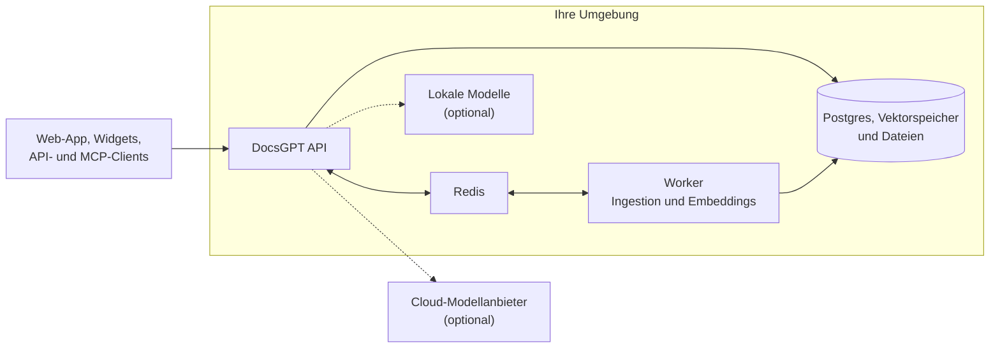

<!-- Translated from README.md at commit c0f7f2d9afbd9e423b65ae785e3a2d4366367265 by .github/workflows/readme-translations.yml. Fix wording here; change structure in README.md. -->
<h1 align="center">
  DocsGPT 🦖
</h1>

<p align="center">
  <strong>Open-Source-KI-Agenten, die auf Ihren Dokumenten basieren. Privat, selbst gehostet, jedes Modell.</strong>
</p>

<p align="center">
  <a href="https://github.com/arc53/DocsGPT"></a>
  <a href="https://github.com/arc53/DocsGPT/blob/main/LICENSE"></a>
  <a href="https://www.bestpractices.dev/projects/9907"></a>
  <a href="https://discord.gg/vN7YFfdMpj"></a>
  <a href="https://x.com/docsgptai"></a>
</p>

<p align="center">
  <a href="https://docs.docsgpt.cloud/quickstart">⚡️ Schnellstart</a> •
  <a href="https://app.docsgpt.cloud/">☁️ Cloud</a> •
  <a href="https://docs.docsgpt.cloud/">📖 Dokumentation</a> •
  <a href="https://discord.gg/vN7YFfdMpj">💬 Discord</a> •
  <a href="https://blog.docsgpt.cloud/">🗞 Blog</a>
</p>

<!-- languages:start -->
<p align="center">
  <a href="../../README.md">English</a> |
  <strong>Deutsch</strong> |
  <a href="README.es.md">Español</a> |
  <a href="README.ja.md">日本語</a> |
  <a href="README.ru.md">Русский</a> |
  <a href="README.zh-CN.md">简体中文</a> |
  <a href="README.zh-TW.md">繁體中文</a>
</p>
<!-- languages:end -->

> [!TIP]
> Mit einem Befehl selbst hosten. Unter macOS und Linux:
> ```bash
> curl -fsSL https://docs.ac/install | bash
> ```
> Unter Windows (PowerShell): `irm https://docs.ac/install.ps1 | iex`

<p align="center">
  <a href="https://docs.docsgpt.cloud/">
    
  </a>
</p>

> 🎃 **Hacktoberfest 2026:** T-Shirts für wertvolle Beiträge den ganzen Oktober über. Siehe [HACKTOBERFEST.md](../../HACKTOBERFEST.md).

## Warum DocsGPT

DocsGPT verwandelt Ihre Dokumente, Websites und verbundenen Apps in KI-Agenten, die mit Quellen antworten. Erstellen Sie Agenten und
visuelle Workflows, geben Sie ihnen Tools und integrieren Sie sie über ein Widget, eine OpenAI-kompatible API oder einen
MCP-Server in Ihr Produkt. DocsGPT läuft vollständig in Ihrer Umgebung mit dem Modell Ihrer Wahl – in der Cloud oder lokal – und alles,
einschließlich SSO, Teams und Kontingenten, ist unter der MIT-Lizenz verfügbar.

## Schnellstart

Das Installationsprogramm oben prüft [Docker](https://docs.docker.com/engine/install/), installiert den Befehl `docsgpt` und
führt `docsgpt up` aus. Dabei werden Sie gefragt, wer DocsGPT nutzen soll und welches Modell verwendet werden soll. Eine lokale Installation öffnen Sie unter
[http://localhost:7091](http://localhost:7091).

Sie bevorzugen Docker Compose, pip, Kubernetes oder eine Air-Gap-Installation? Siehe [Deployment auswählen](https://docs.docsgpt.cloud/Deploying).
Sie möchten es nur ausprobieren? Nutzen Sie [DocsGPT Cloud](https://app.docsgpt.cloud/).

## Funktionen

- 🤖 **Agenten und Deep Research:** Agenten mit eigenem Prompt, Wissen, Tools und Modell sowie ein Recherchemodus für mehrstufige Antworten.
- 🔀 **Visuelle Workflows:** Verketten Sie Agenten, Bedingungen, Status und isolierten Code in einem Drag-and-Drop-Builder.
- 📚 **Wissen aus jeder Quelle:** PDFs, Office-Dateien, Webseiten, Audio und mehr – synchron gehalten mit Google Drive, SharePoint, Confluence, GitHub, S3 und weiteren Diensten, mit GraphRAG.
- 🔎 **Antworten mit Quellen:** Jede Antwort verweist auf die Dokumente, aus denen sie stammt.
- 🛠️ **Tools und Aktionen:** Websuche, jede REST API, MCP-Server, Artefakte und Code in einer Sandbox sowie Shell auf gekoppelten Geräten.
- 🧠 **Jedes Modell:** OpenAI, Anthropic, Google, Groq, OpenRouter oder lokale Modelle über Ollama, vLLM und andere OpenAI-kompatible Server.
- 🛡️ **Guardrails:** Erkennen, schwärzen oder blockieren Sie PII, Geheimnisse, Prompt Injection und nicht fundierte Antworten.
- ⏰ **Zeitpläne und Webhooks:** Führen Sie Agenten nach Zeitplan oder aus jedem System aus, das eine HTTP-Anfrage senden kann.

https://github.com/user-attachments/assets/d36bbd7d-c23c-4ab8-8777-b432632d6882

<table>
  <tr>
    <td width="50%" valign="top">
      <a href="https://docs.docsgpt.cloud/Agents/basics"></a>
      <p align="center"><b>Agenten</b>: Wissen, Tools und ein Prompt, mit einem Klick veröffentlicht</p>
    </td>
    <td width="50%" valign="top">
      <a href="https://docs.docsgpt.cloud/Agents/nodes"></a>
      <p align="center"><b>Workflows</b>: Agenten und Logik auf einer Arbeitsfläche</p>
    </td>
  </tr>
  <tr>
    <td width="50%" valign="top">
      <a href="https://docs.docsgpt.cloud/Sources/Connectors"></a>
      <p align="center"><b>Wissen</b>: Einen Dienst verbinden und synchron halten</p>
    </td>
    <td width="50%" valign="top">
      <a href="https://docs.docsgpt.cloud/Extensions/chat-widget"></a>
      <p align="center"><b>Widget</b>: Ihr Agent auf jeder Website</p>
    </td>
  </tr>
</table>

Alles Weitere finden Sie in der [Dokumentation](https://docs.docsgpt.cloud/).

## Überall einsetzen

- **Web-App:** Chat, Agenten, Wissen und Einstellungen im Browser.
- **Chat- und Such-Widgets:** Fügen Sie einen Agenten mit einem Script-Tag oder dem [React-Paket](https://docs.docsgpt.cloud/Extensions/chat-widget) in jede Website ein.
- **OpenAI-kompatible API:** Richten Sie ein beliebiges OpenAI SDK auf [`/v1`](https://docs.docsgpt.cloud/API/openai-compatible), oder nutzen Sie die [Agent API](https://docs.docsgpt.cloud/API/agent-api) und [Webhooks](https://docs.docsgpt.cloud/API/webhooks).
- **MCP-Server:** Lassen Sie Claude, Cursor oder jeden [MCP-Client](https://docs.docsgpt.cloud/API/mcp-server) das Wissen Ihres Agenten durchsuchen.
- **Chat-Apps und Terminal:** Bots für [Discord](https://github.com/arc53/discord-docsgpt-extension), [Slack](https://github.com/arc53/slack-bot-docsgpt-extenstion) und [Telegram](https://github.com/arc53/tg-bot-docsgpt-extenstion) sowie die [DocsGPT CLI](https://github.com/arc53/DocsGPT-cli). Mehr unter [Community-Integrationen](https://docs.docsgpt.cloud/Extensions/community).

## Von Grund auf privat

Alles läuft in Ihrer Umgebung: die API, der Worker, Postgres, Redis, Ihr Vektorspeicher und Ihre Dateien.
Wählen Sie einen Cloud-Modellanbieter oder führen Sie Modelle und Embeddings lokal aus – sogar [ohne Netzwerkverbindung](https://docs.docsgpt.cloud/Deploying/Air-Gapped).



Lesen Sie den [Architekturleitfaden](https://docs.docsgpt.cloud/Concepts/Architecture) und die
[Sicherheits-Checkliste](https://docs.docsgpt.cloud/Deploying/Security), bevor Sie DocsGPT über Ihren eigenen Rechner hinaus zugänglich machen.

## Selbst hosten

Nach der Installation mit einem Befehl verwaltet der Befehl `docsgpt` den Stack:

```bash
docsgpt status     # Version, Adresse und Status
docsgpt logs       # Logs verfolgen
docsgpt upgrade    # Auf die neue Version aktualisieren und neu starten
docsgpt backup     # Datenbank und hochgeladene Daten sichern
docsgpt down       # Anhalten (Daten und Einstellungen bleiben erhalten)
```

Alle Befehle finden Sie in der [CLI-Referenz](https://docs.docsgpt.cloud/Deploying/cli). Weitere Möglichkeiten zur Ausführung:
[Docker Compose](https://docs.docsgpt.cloud/Deploying/Docker-Deploying),
[pip](https://docs.docsgpt.cloud/Deploying/Pip-Install),
[Kubernetes](https://docs.docsgpt.cloud/Deploying/Kubernetes-Deploying),
[ohne Netzwerkverbindung](https://docs.docsgpt.cloud/Deploying/Air-Gapped) oder
[aus einem Clone mit dem Setup-Skript](https://docs.docsgpt.cloud/Deploying/Docker-Deploying#using-the-source-checkout).
Wenn Sie an DocsGPT selbst arbeiten möchten, lesen Sie den [Leitfaden zur Entwicklungsumgebung](https://docs.docsgpt.cloud/Deploying/Development-Environment).

## Für Teams

- **Single Sign-on:** Bereitstellung mit [OIDC und SCIM](https://docs.docsgpt.cloud/Deploying/OIDC-SSO).
- **Zugriffskontrolle:** [Rollen, Teams und Freigaben](https://docs.docsgpt.cloud/Deploying/Access-Control) für Agenten, Wissen und Tools – mit Audit-Log.
- **Nutzungskontingente:** [Token- und Ausgabenlimits](https://docs.docsgpt.cloud/Deploying/Usage-Quotas) pro Benutzer und Team.
- **Einblicke:** Analysen, Logs und Traces sowie [OpenTelemetry](https://docs.docsgpt.cloud/Deploying/Observability).

Sie möchten DocsGPT für Ihr Unternehmen bereitstellen? [Demo anfragen](https://www.docsgpt.cloud/contact) oder
[uns eine E-Mail schreiben](mailto:support@docsgpt.cloud?subject=DocsGPT%20support%2Fsolutions).

## Mitwirken

Wir freuen uns über Issues, Fragen und Pull Requests. Beginnen Sie mit [CONTRIBUTING.md](../../CONTRIBUTING.md), sehen Sie sich die
[Roadmap](https://github.com/orgs/arc53/projects/2) und das [Changelog](https://docs.docsgpt.cloud/changelog) an und sagen Sie Hallo auf
[Discord](https://discord.gg/vN7YFfdMpj). Bitte befolgen Sie unseren [Verhaltenskodex](../../CODE_OF_CONDUCT.md).

<details>
<summary>Tech-Stack und Projektstruktur</summary>

- **Backend:** Python, Flask und flask-restx hinter einer Starlette-ASGI-App (uvicorn/gunicorn), Celery mit RedBeat, Pydantic-Einstellungen.
- **Daten:** PostgreSQL (SQLAlchemy, Alembic), Redis und FAISS, pgvector, Elasticsearch, Qdrant, Milvus oder MongoDB für Vektoren.
- **Frontend:** React, Vite, Redux Toolkit, Tailwind CSS und React Flow.
- **Dokumentation:** Next.js mit Nextra.

Projektstruktur:

- `docsgpt/`: das Backend und der Befehl `docsgpt` (API, Agenten, Tools, Retrieval, Parser, Worker).
- `frontend/`: die Weboberfläche.
- `extensions/`: die Chatwoot-Bridge und das React-Widget (als `docsgpt` auf npm veröffentlicht).
- `deployment/`: Docker-Compose-Dateien, Kubernetes-Manifeste, Installationsskripte und das Sandbox-Image.
- `docs/`: die Dokumentationswebsite unter [docs.docsgpt.cloud](https://docs.docsgpt.cloud).
- `tests/` und `scripts/`: Tests sowie Wartungs- und Migrationsskripte.

</details>

## Lizenz

DocsGPT ist [unter der MIT-Lizenz verfügbar](../../LICENSE).

## Unterstützt von

<p>
  <a href="https://www.digitalocean.com/?utm_medium=opensource&utm_source=DocsGPT">
    
  </a>
</p>
<p>
  <a href="https://get.neon.com/docsgpt">
    
  </a>
</p>
<p>
  <a href="https://vercel.com/open-source-program">
    
  </a>
</p>
