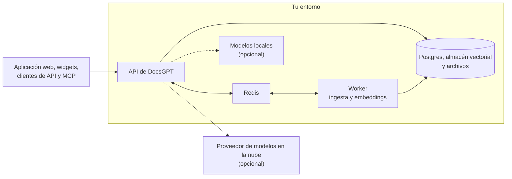

<!-- Translated from README.md at commit 7974998b8f162961478a95eff9cb7ac62286c8f8 by .github/workflows/readme-translations.yml. Fix wording here; change structure in README.md. -->
<h1 align="center">
  DocsGPT 🦖
</h1>

<p align="center">
  <strong>Agentes de IA de código abierto basados en tus documentos. Privados, autoalojados y con cualquier modelo.</strong>
</p>

<p align="center">
  <a href="https://github.com/arc53/DocsGPT"></a>
  <a href="https://github.com/arc53/DocsGPT/blob/main/LICENSE"></a>
  <a href="https://www.bestpractices.dev/projects/9907"></a>
  <a href="https://discord.gg/vN7YFfdMpj"></a>
  <a href="https://x.com/docsgptai"></a>
</p>

<p align="center">
  <a href="https://docs.docsgpt.cloud/quickstart">⚡️ Inicio rápido</a> •
  <a href="https://app.docsgpt.cloud/">☁️ Nube</a> •
  <a href="https://docs.docsgpt.cloud/">📖 Documentación</a> •
  <a href="https://discord.gg/vN7YFfdMpj">💬 Discord</a> •
  <a href="https://blog.docsgpt.cloud/">🗞 Blog</a>
</p>

<!-- languages:start -->
<p align="center">
  <a href="../../README.md">English</a> |
  <a href="README.de.md">Deutsch</a> |
  <strong>Español</strong> |
  <a href="README.ja.md">日本語</a> |
  <a href="README.ru.md">Русский</a> |
  <a href="README.zh-CN.md">简体中文</a> |
  <a href="README.zh-TW.md">繁體中文</a>
</p>
<!-- languages:end -->

> [!TIP]
> Autoaloja con un solo comando. En macOS y Linux:
> ```bash
> curl -fsSL https://docs.ac/install | bash
> ```
> En Windows (PowerShell): `irm https://docs.ac/install.ps1 | iex`

<p align="center">
  <a href="https://docs.docsgpt.cloud/">
    
  </a>
</p>

> 🎃 **Hacktoberfest 2026:** camisetas para contribuciones significativas durante todo octubre. Consulta [HACKTOBERFEST.md](../../HACKTOBERFEST.md).

## Por qué DocsGPT

DocsGPT convierte tus documentos, sitios y aplicaciones conectadas en agentes de IA que responden con fuentes. Crea agentes y
flujos de trabajo visuales, proporciónales herramientas e intégralos en tu producto mediante un widget, una API compatible con OpenAI o un
servidor MCP. Se ejecuta por completo en tu entorno con el modelo que elijas, en la nube o local, y todo,
incluidos SSO, equipos y cuotas, tiene licencia MIT.

## Inicio rápido

El instalador anterior comprueba si tienes [Docker](https://docs.docker.com/engine/install/), instala el comando `docsgpt` y
ejecuta `docsgpt up`, que pregunta quién debe acceder a DocsGPT y qué modelo usar. Una instalación local se abre en
[http://localhost:7091](http://localhost:7091).

¿Prefieres Docker Compose, pip, Kubernetes o una instalación aislada de la red? Consulta [Elige un despliegue](https://docs.docsgpt.cloud/Deploying).
¿Solo quieres probarlo? Usa [DocsGPT Cloud](https://app.docsgpt.cloud/).

## Características

- 🤖 **Agentes e investigación profunda:** agentes con su propio prompt, conocimiento, herramientas y modelo, además de un modo de investigación para respuestas de varios pasos.
- 🔀 **Flujos de trabajo visuales:** encadena agentes, condiciones, estado y código en sandbox en un creador de arrastrar y soltar.
- 📚 **Conocimiento desde cualquier lugar:** PDF, archivos de Office, páginas web, audio y más, sincronizados desde Google Drive, SharePoint, Confluence, GitHub, S3 y otros, con GraphRAG.
- 🔎 **Respuestas con fuentes:** cada respuesta cita los documentos de los que procede.
- 🛠️ **Herramientas y acciones:** búsqueda web, cualquier API REST, servidores MCP, artefactos y código en un sandbox, y shell en dispositivos emparejados.
- 🧠 **Cualquier modelo:** OpenAI, Anthropic, Google, Groq, OpenRouter o modelos locales mediante Ollama, vLLM y otros servidores compatibles con OpenAI.
- 🛡️ **Barreras de seguridad:** detecta, censura o bloquea PII, secretos, inyección de prompts y respuestas sin fundamento.
- ⏰ **Programaciones y webhooks:** ejecuta agentes mediante un temporizador o desde cualquier sistema que pueda enviar una solicitud HTTP.

https://github.com/user-attachments/assets/d36bbd7d-c23c-4ab8-8777-b432632d6882

<table>
  <tr>
    <td width="50%" valign="top">
      <a href="https://docs.docsgpt.cloud/Agents/basics"></a>
      <p align="center"><b>Agentes</b>: conocimiento, herramientas y un prompt, publicados con un clic</p>
    </td>
    <td width="50%" valign="top">
      <a href="https://docs.docsgpt.cloud/Agents/nodes"></a>
      <p align="center"><b>Flujos de trabajo</b>: agentes y lógica en un solo lienzo</p>
    </td>
  </tr>
  <tr>
    <td width="50%" valign="top">
      <a href="https://docs.docsgpt.cloud/Sources/Connectors"></a>
      <p align="center"><b>Conocimiento</b>: conecta un servicio y mantenlo sincronizado</p>
    </td>
    <td width="50%" valign="top">
      <a href="https://docs.docsgpt.cloud/Extensions/chat-widget"></a>
      <p align="center"><b>Widget</b>: tu agente en cualquier sitio web</p>
    </td>
  </tr>
</table>

Consulta la [documentación](https://docs.docsgpt.cloud/) para conocer todo lo demás.

## Úsalo en cualquier lugar

- **Aplicación web:** chat, agentes, conocimiento y ajustes en el navegador.
- **Widgets de chat y búsqueda:** incorpora un agente en cualquier sitio con una etiqueta de script o el [paquete de React](https://docs.docsgpt.cloud/Extensions/chat-widget).
- **API compatible con OpenAI:** dirige cualquier SDK de OpenAI a [`/v1`](https://docs.docsgpt.cloud/API/openai-compatible), o usa la [API de agentes](https://docs.docsgpt.cloud/API/agent-api) y los [webhooks](https://docs.docsgpt.cloud/API/webhooks).
- **Servidor MCP:** permite que Claude, Cursor o cualquier [cliente MCP](https://docs.docsgpt.cloud/API/mcp-server) busque en el conocimiento de tu agente.
- **Aplicaciones de chat y terminal:** bots para [Discord](https://github.com/arc53/discord-docsgpt-extension), [Slack](https://github.com/arc53/slack-bot-docsgpt-extenstion) y [Telegram](https://github.com/arc53/tg-bot-docsgpt-extenstion), y la [CLI de DocsGPT](https://github.com/arc53/DocsGPT-cli). Más en las [integraciones de la comunidad](https://docs.docsgpt.cloud/Extensions/community).

## Privado por diseño

Todo se ejecuta dentro de tu entorno: la API, el worker, Postgres, Redis, tu almacén vectorial y tus archivos.
Elige un proveedor de modelos en la nube o ejecuta modelos y embeddings localmente, incluso [aislado de la red](https://docs.docsgpt.cloud/Deploying/Air-Gapped).



Lee la [guía de arquitectura](https://docs.docsgpt.cloud/Concepts/Architecture) y la
[lista de verificación de seguridad](https://docs.docsgpt.cloud/Deploying/Security) antes de exponer DocsGPT más allá de tu máquina.

## Autoalojamiento

Tras la instalación con un solo comando, el comando `docsgpt` gestiona la pila:

```bash
docsgpt status     # versión, dirección y estado
docsgpt logs       # seguir los registros
docsgpt upgrade    # actualizar y reiniciar con la nueva versión
docsgpt backup     # hacer una copia de seguridad de la base de datos y los datos cargados
docsgpt down       # detener (los datos y ajustes se conservan)
```

Consulta la [referencia de la CLI](https://docs.docsgpt.cloud/Deploying/cli) para ver todos los comandos. Otras formas de ejecutarlo:
[Docker Compose](https://docs.docsgpt.cloud/Deploying/Docker-Deploying),
[pip](https://docs.docsgpt.cloud/Deploying/Pip-Install),
[Kubernetes](https://docs.docsgpt.cloud/Deploying/Kubernetes-Deploying),
[aislado de la red](https://docs.docsgpt.cloud/Deploying/Air-Gapped) o
[desde un clon con el script de configuración](https://docs.docsgpt.cloud/Deploying/Docker-Deploying#using-the-source-checkout).
Para trabajar en DocsGPT, consulta la [guía del entorno de desarrollo](https://docs.docsgpt.cloud/Deploying/Development-Environment).

## Para equipos

- **Inicio de sesión único:** aprovisionamiento mediante [OIDC y SCIM](https://docs.docsgpt.cloud/Deploying/OIDC-SSO).
- **Control de acceso:** [roles, equipos y uso compartido](https://docs.docsgpt.cloud/Deploying/Access-Control) para agentes, conocimiento y herramientas, con un registro de auditoría.
- **Cuotas de uso:** [límites de tokens y gasto](https://docs.docsgpt.cloud/Deploying/Usage-Quotas) por usuario y equipo.
- **Información:** analíticas, registros y trazas, además de [OpenTelemetry](https://docs.docsgpt.cloud/Deploying/Observability).

¿Vas a desplegar DocsGPT para tu empresa? [Solicita una demostración](https://www.docsgpt.cloud/contact) o
[escríbenos](mailto:support@docsgpt.cloud?subject=DocsGPT%20support%2Fsolutions).

## Contribuir

Aceptamos issues, preguntas y pull requests. Empieza con [CONTRIBUTING.md](../../CONTRIBUTING.md), consulta la
[hoja de ruta](https://github.com/orgs/arc53/projects/2) y el [registro de cambios](https://docs.docsgpt.cloud/changelog), y saluda en
[Discord](https://discord.gg/vN7YFfdMpj). Sigue nuestro [Código de conducta](../../CODE_OF_CONDUCT.md).

<details>
<summary>Pila tecnológica y estructura del proyecto</summary>

- **Backend:** Python, Flask y flask-restx detrás de una aplicación Starlette ASGI (uvicorn/gunicorn), Celery con RedBeat y configuración de Pydantic.
- **Datos:** PostgreSQL (SQLAlchemy, Alembic), Redis y FAISS, pgvector, Elasticsearch, Qdrant, Milvus o MongoDB para vectores.
- **Frontend:** React, Vite, Redux Toolkit, Tailwind CSS y React Flow.
- **Documentación:** Next.js con Nextra.

Estructura del proyecto:

- `docsgpt/`: el backend y el comando `docsgpt` (API, agentes, herramientas, recuperación, analizadores, worker).
- `frontend/`: la interfaz web.
- `extensions/`: el puente de Chatwoot y el widget de React (publicado en npm como `docsgpt`).
- `deployment/`: archivos de Docker Compose, manifiestos de Kubernetes, scripts del instalador y la imagen de sandbox.
- `docs/`: el sitio de documentación en [docs.docsgpt.cloud](https://docs.docsgpt.cloud).
- `tests/` y `scripts/`: pruebas y scripts de mantenimiento y migración.

</details>

## Licencia

DocsGPT cuenta con [licencia MIT](../../LICENSE).

## Con el apoyo de

<p>
  <a href="https://www.digitalocean.com/?utm_medium=opensource&utm_source=DocsGPT">
    
  </a>
</p>
<p>
  <a href="https://get.neon.com/docsgpt">
    
  </a>
</p>

