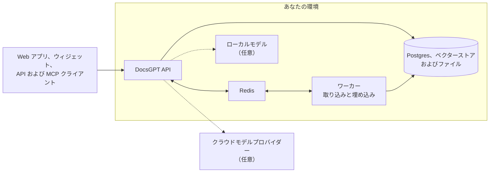

<!-- Translated from README.md at commit c0f7f2d9afbd9e423b65ae785e3a2d4366367265 by .github/workflows/readme-translations.yml. Fix wording here; change structure in README.md. -->
<h1 align="center">
  DocsGPT 🦖
</h1>

<p align="center">
  <strong>あなたのドキュメントに基づくオープンソース AI エージェント。プライベート、セルフホスト、あらゆるモデルに対応。</strong>
</p>

<p align="center">
  <a href="https://github.com/arc53/DocsGPT"></a>
  <a href="https://github.com/arc53/DocsGPT/blob/main/LICENSE"></a>
  <a href="https://www.bestpractices.dev/projects/9907"></a>
  <a href="https://discord.gg/vN7YFfdMpj"></a>
  <a href="https://x.com/docsgptai"></a>
</p>

<p align="center">
  <a href="https://docs.docsgpt.cloud/quickstart">⚡️ クイックスタート</a> •
  <a href="https://app.docsgpt.cloud/">☁️ クラウド</a> •
  <a href="https://docs.docsgpt.cloud/">📖 ドキュメント</a> •
  <a href="https://discord.gg/vN7YFfdMpj">💬 Discord</a> •
  <a href="https://blog.docsgpt.cloud/">🗞 ブログ</a>
</p>

<!-- languages:start -->
<p align="center">
  <a href="../../README.md">English</a> |
  <a href="README.de.md">Deutsch</a> |
  <a href="README.es.md">Español</a> |
  <strong>日本語</strong> |
  <a href="README.ru.md">Русский</a> |
  <a href="README.zh-CN.md">简体中文</a> |
  <a href="README.zh-TW.md">繁體中文</a>
</p>
<!-- languages:end -->

> [!TIP]
> 1 コマンドでセルフホストできます。macOS と Linux の場合：
> ```bash
> curl -fsSL https://docs.ac/install | bash
> ```
> Windows（PowerShell）の場合：`irm https://docs.ac/install.ps1 | iex`

<p align="center">
  <a href="https://docs.docsgpt.cloud/">
    
  </a>
</p>

> 🎃 **Hacktoberfest 2026：** 10 月中、意義のあるコントリビューションには T シャツをプレゼントします。詳細は [HACKTOBERFEST.md](../../HACKTOBERFEST.md) をご覧ください。

## DocsGPT を選ぶ理由

DocsGPT は、ドキュメント、サイト、接続済みアプリを、出典付きで回答する AI エージェントに変えます。エージェントと
ビジュアルワークフローを構築し、ツールを与え、ウィジェット、OpenAI 互換 API、または
MCP サーバーを通じて製品に組み込めます。クラウドでもローカルでも、選んだモデルを使ってすべて自分の環境で実行でき、
SSO、チーム、クォータを含むすべてが MIT ライセンスです。

## クイックスタート

上記のインストーラーは [Docker](https://docs.docker.com/engine/install/) を確認し、`docsgpt` コマンドをインストールして、
`docsgpt up` を実行します。このコマンドでは、DocsGPT にアクセスするユーザーと使用するモデルを選択します。ローカルインストールは
[http://localhost:7091](http://localhost:7091) で開きます。

Docker Compose、pip、Kubernetes、またはエアギャップ環境でのインストールをご希望ですか？ [デプロイ方法を選ぶ](https://docs.docsgpt.cloud/Deploying) をご覧ください。
まず試してみたいだけなら、[DocsGPT Cloud](https://app.docsgpt.cloud/) をご利用ください。

## 機能

- 🤖 **エージェントとディープリサーチ：** 独自のプロンプト、ナレッジ、ツール、モデルを持つエージェントに加え、複数ステップの回答のためのリサーチモード。
- 🔀 **ビジュアルワークフロー：** ドラッグ＆ドロップビルダーで、エージェント、条件、状態、サンドボックス化されたコードを連携。
- 📚 **あらゆる場所のナレッジ：** PDF、Office ファイル、Web ページ、音声などを、GraphRAG とともに Google Drive、SharePoint、Confluence、GitHub、S3 などから同期して最新の状態に維持。
- 🔎 **出典付きの回答：** すべての回答で、元となったドキュメントを引用。
- 🛠️ **ツールとアクション：** Web 検索、任意の REST API、MCP サーバー、アーティファクト、サンドボックス内のコード、ペアリングしたデバイス上のシェル。
- 🧠 **あらゆるモデル：** OpenAI、Anthropic、Google、Groq、OpenRouter、または Ollama、vLLM、その他の OpenAI 互換サーバーを通じたローカルモデル。
- 🛡️ **ガードレール：** PII、シークレット、プロンプトインジェクション、根拠のない回答をフラグ、マスキング、またはブロック。
- ⏰ **スケジュールと Webhook：** タイマー、または HTTP リクエストを送信できる任意のシステムからエージェントを実行。

https://github.com/user-attachments/assets/d36bbd7d-c23c-4ab8-8777-b432632d6882

<table>
  <tr>
    <td width="50%" valign="top">
      <a href="https://docs.docsgpt.cloud/Agents/basics"></a>
      <p align="center"><b>エージェント</b>：ナレッジ、ツール、プロンプトを設定し、ワンクリックで公開</p>
    </td>
    <td width="50%" valign="top">
      <a href="https://docs.docsgpt.cloud/Agents/nodes"></a>
      <p align="center"><b>ワークフロー</b>：一つのキャンバスでエージェントとロジックを構築</p>
    </td>
  </tr>
  <tr>
    <td width="50%" valign="top">
      <a href="https://docs.docsgpt.cloud/Sources/Connectors"></a>
      <p align="center"><b>ナレッジ</b>：サービスを接続して同期を維持</p>
    </td>
    <td width="50%" valign="top">
      <a href="https://docs.docsgpt.cloud/Extensions/chat-widget"></a>
      <p align="center"><b>ウィジェット</b>：任意の Web サイトにエージェントを配置</p>
    </td>
  </tr>
</table>

その他の機能については、[ドキュメント](https://docs.docsgpt.cloud/) をご覧ください。

## どこでも使える

- **Web アプリ：** ブラウザーでチャット、エージェント、ナレッジ、設定を管理。
- **チャットと検索ウィジェット：** スクリプトタグまたは [React パッケージ](https://docs.docsgpt.cloud/Extensions/chat-widget)で、任意のサイトにエージェントを追加。
- **OpenAI 互換 API：** 任意の OpenAI SDK を [`/v1`](https://docs.docsgpt.cloud/API/openai-compatible) に向けるか、[Agent API](https://docs.docsgpt.cloud/API/agent-api) と [Webhook](https://docs.docsgpt.cloud/API/webhooks) を使用。
- **MCP サーバー：** Claude、Cursor、または任意の [MCP クライアント](https://docs.docsgpt.cloud/API/mcp-server)から、エージェントのナレッジを検索。
- **チャットアプリとターミナル：** [Discord](https://github.com/arc53/discord-docsgpt-extension)、[Slack](https://github.com/arc53/slack-bot-docsgpt-extenstion)、[Telegram](https://github.com/arc53/tg-bot-docsgpt-extenstion) 用のボット、および [DocsGPT CLI](https://github.com/arc53/DocsGPT-cli)。詳細は [コミュニティ統合](https://docs.docsgpt.cloud/Extensions/community) をご覧ください。

## プライバシーを前提に設計

API、ワーカー、Postgres、Redis、ベクターストア、ファイルなど、すべてが自分の環境内で実行されます。
クラウドモデルプロバイダーを選ぶことも、[エアギャップ](https://docs.docsgpt.cloud/Deploying/Air-Gapped)環境を含め、モデルと埋め込みをローカルで実行することもできます。



DocsGPT を自分のマシン以外に公開する前に、[アーキテクチャガイド](https://docs.docsgpt.cloud/Concepts/Architecture)と
[セキュリティチェックリスト](https://docs.docsgpt.cloud/Deploying/Security)をお読みください。

## セルフホスト

1 コマンドでのインストール後は、`docsgpt` コマンドでスタックを管理します。

```bash
docsgpt status     # バージョン、アドレス、ヘルス状態
docsgpt logs       # ログを追跡
docsgpt upgrade    # 新しいバージョンへアップグレードして再起動
docsgpt backup     # データベースとアップロード済みデータをバックアップ
docsgpt down       # 停止（データと設定は保持）
```

すべてのコマンドについては [CLI リファレンス](https://docs.docsgpt.cloud/Deploying/cli) をご覧ください。その他の実行方法：
[Docker Compose](https://docs.docsgpt.cloud/Deploying/Docker-Deploying)、
[pip](https://docs.docsgpt.cloud/Deploying/Pip-Install)、
[Kubernetes](https://docs.docsgpt.cloud/Deploying/Kubernetes-Deploying)、
[エアギャップ環境](https://docs.docsgpt.cloud/Deploying/Air-Gapped)、または
[クローンからセットアップスクリプトを使用](https://docs.docsgpt.cloud/Deploying/Docker-Deploying#using-the-source-checkout)。
DocsGPT 自体の開発については、[開発環境ガイド](https://docs.docsgpt.cloud/Deploying/Development-Environment) をご覧ください。

## チーム向け

- **シングルサインオン：** [OIDC および SCIM](https://docs.docsgpt.cloud/Deploying/OIDC-SSO) プロビジョニング。
- **アクセス制御：** 監査ログとともに、エージェント、ナレッジ、ツール向けの[ロール、チーム、共有](https://docs.docsgpt.cloud/Deploying/Access-Control)。
- **使用量クォータ：** ユーザーおよびチームごとの[トークンと利用額の上限](https://docs.docsgpt.cloud/Deploying/Usage-Quotas)。
- **インサイト：** 分析、ログ、トレースに加え、[OpenTelemetry](https://docs.docsgpt.cloud/Deploying/Observability)。

自社向けに DocsGPT をデプロイしますか？ [デモを依頼](https://www.docsgpt.cloud/contact)するか、
[メールでお問い合わせください](mailto:support@docsgpt.cloud?subject=DocsGPT%20support%2Fsolutions)。

## コントリビューション

Issue、質問、プルリクエストを歓迎します。まず [CONTRIBUTING.md](../../CONTRIBUTING.md) をお読みいただき、
[ロードマップ](https://github.com/orgs/arc53/projects/2)と[変更履歴](https://docs.docsgpt.cloud/changelog)を確認し、
[Discord](https://discord.gg/vN7YFfdMpj)で気軽に声をかけてください。[行動規範](../../CODE_OF_CONDUCT.md)にも従ってください。

<details>
<summary>技術スタックとプロジェクト構成</summary>

- **バックエンド：** Starlette ASGI アプリ（uvicorn/gunicorn）上の Python、Flask、flask-restx、RedBeat を使用する Celery、Pydantic 設定。
- **データ：** PostgreSQL（SQLAlchemy、Alembic）、Redis、およびベクター向けの FAISS、pgvector、Elasticsearch、Qdrant、Milvus、MongoDB。
- **フロントエンド：** React、Vite、Redux Toolkit、Tailwind CSS、React Flow。
- **ドキュメント：** Nextra を使用する Next.js。

プロジェクト構成：

- `docsgpt/`：バックエンドと `docsgpt` コマンド（API、エージェント、ツール、検索、パーサー、ワーカー）。
- `frontend/`：Web UI。
- `extensions/`：Chatwoot ブリッジと React ウィジェット（`docsgpt` として npm に公開）。
- `deployment/`：Docker Compose ファイル、Kubernetes マニフェスト、インストーラースクリプト、サンドボックスイメージ。
- `docs/`：[docs.docsgpt.cloud](https://docs.docsgpt.cloud) のドキュメントサイト。
- `tests/` および `scripts/`：テスト、保守スクリプト、移行スクリプト。

</details>

## ライセンス

DocsGPT は [MIT ライセンス](../../LICENSE)です。

## サポート

<p>
  <a href="https://www.digitalocean.com/?utm_medium=opensource&utm_source=DocsGPT">
    
  </a>
</p>
<p>
  <a href="https://get.neon.com/docsgpt">
    
  </a>
</p>
<p>
  <a href="https://vercel.com/open-source-program">
    
  </a>
</p>


