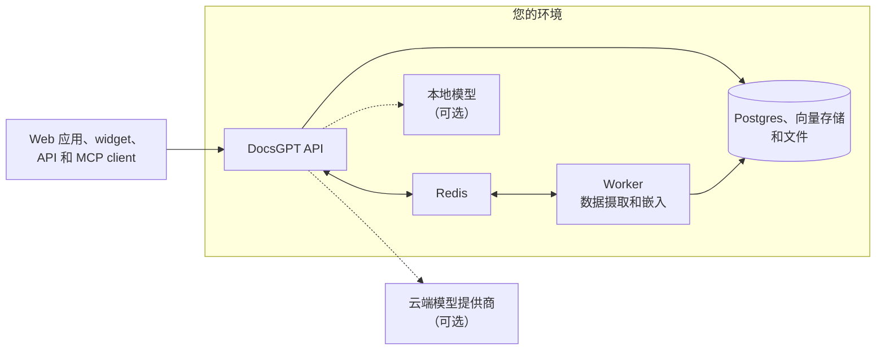

<!-- Translated from README.md at commit c0f7f2d9afbd9e423b65ae785e3a2d4366367265 by .github/workflows/readme-translations.yml. Fix wording here; change structure in README.md. -->
<h1 align="center">
  DocsGPT 🦖
</h1>

<p align="center">
  <strong>基于您的文档构建的开源 AI agent。私有化、自托管，支持任意模型。</strong>
</p>

<p align="center">
  <a href="https://github.com/arc53/DocsGPT"></a>
  <a href="https://github.com/arc53/DocsGPT/blob/main/LICENSE"></a>
  <a href="https://www.bestpractices.dev/projects/9907"></a>
  <a href="https://discord.gg/vN7YFfdMpj"></a>
  <a href="https://x.com/docsgptai"></a>
</p>

<p align="center">
  <a href="https://docs.docsgpt.cloud/quickstart">⚡️ 快速上手</a> •
  <a href="https://app.docsgpt.cloud/">☁️ 云端版</a> •
  <a href="https://docs.docsgpt.cloud/">📖 文档</a> •
  <a href="https://discord.gg/vN7YFfdMpj">💬 Discord</a> •
  <a href="https://blog.docsgpt.cloud/">🗞 博客</a>
</p>

<!-- languages:start -->
<p align="center">
  <a href="../../README.md">English</a> |
  <a href="README.de.md">Deutsch</a> |
  <a href="README.es.md">Español</a> |
  <a href="README.ja.md">日本語</a> |
  <a href="README.ru.md">Русский</a> |
  <strong>简体中文</strong> |
  <a href="README.zh-TW.md">繁體中文</a>
</p>
<!-- languages:end -->

> [!TIP]
> 一条命令即可自托管。在 macOS 和 Linux 上：
> ```bash
> curl -fsSL https://docs.ac/install | bash
> ```
> 在 Windows（PowerShell）上：`irm https://docs.ac/install.ps1 | iex`

<p align="center">
  <a href="https://docs.docsgpt.cloud/">
    
  </a>
</p>

> 🎃 **Hacktoberfest 2026**：整个十月，提交有意义的贡献即可获得 T 恤。请参阅 [HACKTOBERFEST.md](../../HACKTOBERFEST.md)。

## 为什么选择 DocsGPT

DocsGPT 可将您的文档、网站和已连接应用转化为能够引用来源进行回答的 AI agent。构建 agent 和
可视化工作流，为其配备工具，并通过 widget、OpenAI 兼容 API 或
MCP server 将其集成到您的产品中。它完全运行在您的环境内，可选择云端或本地模型，并且包括
SSO、团队和配额在内的一切功能均采用 MIT 许可证。

## 快速上手

上方安装程序会检查 [Docker](https://docs.docker.com/engine/install/)、安装 `docsgpt` 命令，并
运行 `docsgpt up`，该命令会询问哪些人应访问 DocsGPT，以及要使用哪个模型。本地安装完成后，可通过
[http://localhost:7091](http://localhost:7091) 打开。

更倾向于使用 Docker Compose、pip、Kubernetes 或隔离网络安装？请参阅[选择部署方式](https://docs.docsgpt.cloud/Deploying)。
只是想试用？请使用 [DocsGPT Cloud](https://app.docsgpt.cloud/)。

## 功能

- 🤖 **Agent 和深度研究**：agent 可拥有各自的提示词、知识库、工具和模型，并提供用于多步骤回答的研究模式。
- 🔀 **可视化工作流**：在拖放式构建器中串联 agent、条件、状态和沙箱化代码。
- 📚 **任意来源的知识**：支持 PDF、Office 文件、网页、音频等；可从 Google Drive、SharePoint、Confluence、GitHub、S3 等保持同步，并支持 GraphRAG。
- 🔎 **带来源的回答**：每个回答都会引用其来源文档。
- 🛠️ **工具和操作**：网页搜索、任意 REST API、MCP server、沙箱中的产物和代码，以及配对设备上的 shell。
- 🧠 **任意模型**：支持 OpenAI、Anthropic、Google、Groq、OpenRouter，以及通过 Ollama、vLLM 和其他 OpenAI 兼容 server 使用的本地模型。
- 🛡️ **安全护栏**：标记、脱敏或拦截 PII、密钥、提示词注入和无依据的回答。
- ⏰ **计划任务和 webhook**：按定时任务运行 agent，或由任何能够发送 HTTP 请求的系统触发运行。

https://github.com/user-attachments/assets/d36bbd7d-c23c-4ab8-8777-b432632d6882

<table>
  <tr>
    <td width="50%" valign="top">
      <a href="https://docs.docsgpt.cloud/Agents/basics"></a>
      <p align="center"><b>Agent</b>：知识库、工具和提示词，一键发布</p>
    </td>
    <td width="50%" valign="top">
      <a href="https://docs.docsgpt.cloud/Agents/nodes"></a>
      <p align="center"><b>工作流</b>：在同一画布上组合 agent 与逻辑</p>
    </td>
  </tr>
  <tr>
    <td width="50%" valign="top">
      <a href="https://docs.docsgpt.cloud/Sources/Connectors"></a>
      <p align="center"><b>知识库</b>：连接服务并保持同步</p>
    </td>
    <td width="50%" valign="top">
      <a href="https://docs.docsgpt.cloud/Extensions/chat-widget"></a>
      <p align="center"><b>Widget</b>：让您的 agent 进入任何网站</p>
    </td>
  </tr>
</table>

其他功能请参阅[文档](https://docs.docsgpt.cloud/)。

## 随处使用

- **Web 应用**：在浏览器中使用聊天、agent、知识库和设置。
- **聊天和搜索 widget**：通过 script 标签或 [React 包](https://docs.docsgpt.cloud/Extensions/chat-widget)，将 agent 嵌入任何网站。
- **OpenAI 兼容 API**：将任意 OpenAI SDK 指向 [`/v1`](https://docs.docsgpt.cloud/API/openai-compatible)，或使用 [Agent API](https://docs.docsgpt.cloud/API/agent-api) 和 [webhook](https://docs.docsgpt.cloud/API/webhooks)。
- **MCP server**：让 Claude、Cursor 或任意 [MCP client](https://docs.docsgpt.cloud/API/mcp-server) 搜索您的 agent 知识库。
- **聊天应用和终端**：提供适用于 [Discord](https://github.com/arc53/discord-docsgpt-extension)、[Slack](https://github.com/arc53/slack-bot-docsgpt-extenstion) 和 [Telegram](https://github.com/arc53/tg-bot-docsgpt-extenstion) 的 bot，以及 [DocsGPT CLI](https://github.com/arc53/DocsGPT-cli)。更多内容请参阅[社区集成](https://docs.docsgpt.cloud/Extensions/community)。

## 天生私有

一切都在您的环境中运行：API、worker、Postgres、Redis、向量存储和文件。
选择云端模型提供商，或在本地运行模型和嵌入模型，甚至可在[隔离网络](https://docs.docsgpt.cloud/Deploying/Air-Gapped)中部署。



在将 DocsGPT 暴露到您的机器之外之前，请阅读[架构指南](https://docs.docsgpt.cloud/Concepts/Architecture)和
[安全检查清单](https://docs.docsgpt.cloud/Deploying/Security)。

## 自托管

完成一条命令安装后，可通过 `docsgpt` 命令管理整套服务：

```bash
docsgpt status     # 版本、地址和健康状态
docsgpt logs       # 跟踪日志
docsgpt upgrade    # 升级并以新版本重启
docsgpt backup     # 备份数据库和上传的数据
docsgpt down       # 停止（数据和设置会保留）
```

请参阅 [CLI 参考](https://docs.docsgpt.cloud/Deploying/cli) 了解所有命令。其他运行方式包括：
[Docker Compose](https://docs.docsgpt.cloud/Deploying/Docker-Deploying)、
[pip](https://docs.docsgpt.cloud/Deploying/Pip-Install)、
[Kubernetes](https://docs.docsgpt.cloud/Deploying/Kubernetes-Deploying)、
[隔离网络](https://docs.docsgpt.cloud/Deploying/Air-Gapped)，或
[从克隆的仓库通过设置脚本运行](https://docs.docsgpt.cloud/Deploying/Docker-Deploying#using-the-source-checkout)。
如需参与 DocsGPT 本身的开发，请参阅[开发环境指南](https://docs.docsgpt.cloud/Deploying/Development-Environment)。

## 面向团队

- **单点登录：**[OIDC 和 SCIM](https://docs.docsgpt.cloud/Deploying/OIDC-SSO) 预配。
- **访问控制**：针对 agent、知识库和工具提供[角色、团队和共享](https://docs.docsgpt.cloud/Deploying/Access-Control)，并附带审计日志。
- **用量配额**：按用户和团队设置 [token 和支出限额](https://docs.docsgpt.cloud/Deploying/Usage-Quotas)。
- **可观测性**：分析、日志和追踪，以及 [OpenTelemetry](https://docs.docsgpt.cloud/Deploying/Observability)。

要为您的公司部署 DocsGPT？[预约演示](https://www.docsgpt.cloud/contact)或
[发送电子邮件给我们](mailto:support@docsgpt.cloud?subject=DocsGPT%20support%2Fsolutions)。

## 参与贡献

我们欢迎提交 issue、提问和 pull request。请从 [CONTRIBUTING.md](../../CONTRIBUTING.md) 开始，浏览
[路线图](https://github.com/orgs/arc53/projects/2)和[更新日志](https://docs.docsgpt.cloud/changelog)，并在
[Discord](https://discord.gg/vN7YFfdMpj) 向我们打招呼。请遵守我们的[行为准则](../../CODE_OF_CONDUCT.md)。

<details>
<summary>技术栈和项目结构</summary>

- **后端**：Python、Flask 和 flask-restx，运行于 Starlette ASGI 应用（uvicorn/gunicorn）之后；Celery 搭配 RedBeat，Pydantic settings。
- **数据**：PostgreSQL（SQLAlchemy、Alembic）、Redis，以及用于向量的 FAISS、pgvector、Elasticsearch、Qdrant、Milvus 或 MongoDB。
- **前端**：React、Vite、Redux Toolkit、Tailwind CSS 和 React Flow。
- **文档**：使用 Nextra 的 Next.js。

项目结构：

- `docsgpt/`：后端和 `docsgpt` 命令（API、agent、工具、检索、解析器、worker）。
- `frontend/`：Web UI。
- `extensions/`：Chatwoot bridge 和 React widget（以 `docsgpt` 名称发布至 npm）。
- `deployment/`：Docker Compose 文件、Kubernetes 清单、安装脚本和沙箱镜像。
- `docs/`：[docs.docsgpt.cloud](https://docs.docsgpt.cloud) 上的文档网站。
- `tests/` 和 `scripts/`：测试，以及维护和迁移脚本。

</details>

## 许可证

DocsGPT 采用 [MIT 许可证](../../LICENSE)。

## 支持方

<p>
  <a href="https://www.digitalocean.com/?utm_medium=opensource&utm_source=DocsGPT">
    
  </a>
</p>
<p>
  <a href="https://get.neon.com/docsgpt">
    
  </a>
</p>
<p>
  <a href="https://vercel.com/open-source-program">
    
  </a>
</p>


