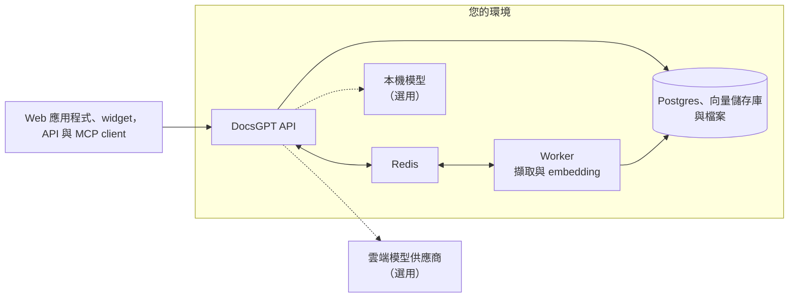

<!-- Translated from README.md at commit 7974998b8f162961478a95eff9cb7ac62286c8f8 by .github/workflows/readme-translations.yml. Fix wording here; change structure in README.md. -->
<h1 align="center">
  DocsGPT 🦖
</h1>

<p align="center">
  <strong>以您的文件為基礎的開源 AI agent。私有、自行代管、支援任何模型。</strong>
</p>

<p align="center">
  <a href="https://github.com/arc53/DocsGPT"></a>
  <a href="https://github.com/arc53/DocsGPT/blob/main/LICENSE"></a>
  <a href="https://www.bestpractices.dev/projects/9907"></a>
  <a href="https://discord.gg/vN7YFfdMpj"></a>
  <a href="https://x.com/docsgptai"></a>
</p>

<p align="center">
  <a href="https://docs.docsgpt.cloud/quickstart">⚡️ 快速入門</a> •
  <a href="https://app.docsgpt.cloud/">☁️ 雲端版</a> •
  <a href="https://docs.docsgpt.cloud/">📖 文件</a> •
  <a href="https://discord.gg/vN7YFfdMpj">💬 Discord</a> •
  <a href="https://blog.docsgpt.cloud/">🗞 部落格</a>
</p>

<!-- languages:start -->
<p align="center">
  <a href="../../README.md">English</a> |
  <a href="README.de.md">Deutsch</a> |
  <a href="README.es.md">Español</a> |
  <a href="README.ja.md">日本語</a> |
  <a href="README.ru.md">Русский</a> |
  <a href="README.zh-CN.md">简体中文</a> |
  <strong>繁體中文</strong>
</p>
<!-- languages:end -->

> [!TIP]
> 一行指令即可自行代管。在 macOS 和 Linux 上：
> ```bash
> curl -fsSL https://docs.ac/install | bash
> ```
> 在 Windows（PowerShell）上：`irm https://docs.ac/install.ps1 | iex`

<p align="center">
  <a href="https://docs.docsgpt.cloud/">
    
  </a>
</p>

> 🎃 **Hacktoberfest 2026**：整個 10 月，只要有實質貢獻就送 T 恤。請參閱 [HACKTOBERFEST.md](../../HACKTOBERFEST.md)。

## 為什麼選擇 DocsGPT

DocsGPT 將您的文件、網站及已連接的應用程式轉化為能附上來源回答問題的 AI agent。建立 agent 與
視覺化 workflow，為它們提供工具，並透過 widget、相容 OpenAI 的 API 或
MCP server 將其導入您的產品。它完全在您的環境中運行，可選擇雲端或本機模型，所有功能
包括 SSO、團隊與配額，均採 MIT 授權。

## 快速入門

上方的安裝程式會檢查 [Docker](https://docs.docker.com/engine/install/)、安裝 `docsgpt` 指令，並執行
`docsgpt up`，接著會詢問哪些人可存取 DocsGPT，以及要使用哪個模型。本機安裝會開啟於
[http://localhost:7091](http://localhost:7091)。

偏好 Docker Compose、pip、Kubernetes 或氣隙隔離安裝？請參閱[選擇部署方式](https://docs.docsgpt.cloud/Deploying)。
只想試用？請使用 [DocsGPT Cloud](https://app.docsgpt.cloud/)。

## 功能

- 🤖 **Agent 與深度研究**：agent 可擁有專屬 prompt、知識、工具與模型，並提供研究模式以產生多步驟回答。
- 🔀 **視覺化 workflow**：在拖放式建構器中串接 agent、條件、狀態與沙箱化程式碼。
- 📚 **來自任何地方的知識**：支援 PDF、Office 檔案、網頁、音訊等格式；可從 Google Drive、SharePoint、Confluence、GitHub、S3 等來源保持同步，並支援 GraphRAG。
- 🔎 **附來源的回答**：每個回答都會引用其來源文件。
- 🛠️ **工具與動作**：網路搜尋、任意 REST API、MCP server、沙箱中的產物與程式碼，以及配對裝置上的 shell。
- 🧠 **任何模型**：OpenAI、Anthropic、Google、Groq、OpenRouter，或透過 Ollama、vLLM 與其他相容 OpenAI 的 server 使用本機模型。
- 🛡️ **防護機制**：標記、遮蔽或封鎖 PII、機密資訊、prompt injection 與缺乏依據的回答。
- ⏰ **排程與 webhook**：依計時器執行 agent，或從任何可傳送 HTTP 請求的系統執行。

https://github.com/user-attachments/assets/d36bbd7d-c23c-4ab8-8777-b432632d6882

<table>
  <tr>
    <td width="50%" valign="top">
      <a href="https://docs.docsgpt.cloud/Agents/basics"></a>
      <p align="center"><b>Agent</b>：知識、工具與 prompt，一鍵發布</p>
    </td>
    <td width="50%" valign="top">
      <a href="https://docs.docsgpt.cloud/Agents/nodes"></a>
      <p align="center"><b>Workflow</b>：在單一畫布上管理 agent 與邏輯</p>
    </td>
  </tr>
  <tr>
    <td width="50%" valign="top">
      <a href="https://docs.docsgpt.cloud/Sources/Connectors"></a>
      <p align="center"><b>知識</b>：連接服務並保持同步</p>
    </td>
    <td width="50%" valign="top">
      <a href="https://docs.docsgpt.cloud/Extensions/chat-widget"></a>
      <p align="center"><b>Widget</b>：將您的 agent 放到任何網站</p>
    </td>
  </tr>
</table>

其他所有內容請參閱[文件](https://docs.docsgpt.cloud/)。

## 隨處使用

- **Web 應用程式**：在瀏覽器中使用聊天、agent、知識與設定。
- **聊天與搜尋 widget**：透過 script tag 或 [React 套件](https://docs.docsgpt.cloud/Extensions/chat-widget)，將 agent 嵌入任何網站。
- **相容 OpenAI 的 API**：將任何 OpenAI SDK 指向 [`/v1`](https://docs.docsgpt.cloud/API/openai-compatible)，或使用 [Agent API](https://docs.docsgpt.cloud/API/agent-api) 與 [webhook](https://docs.docsgpt.cloud/API/webhooks)。
- **MCP server**：讓 Claude、Cursor 或任何 [MCP client](https://docs.docsgpt.cloud/API/mcp-server) 搜尋您 agent 的知識。
- **聊天應用程式與終端機**：支援 [Discord](https://github.com/arc53/discord-docsgpt-extension)、[Slack](https://github.com/arc53/slack-bot-docsgpt-extenstion) 與 [Telegram](https://github.com/arc53/tg-bot-docsgpt-extenstion) 的 bot，以及 [DocsGPT CLI](https://github.com/arc53/DocsGPT-cli)。更多內容請參閱[社群整合](https://docs.docsgpt.cloud/Extensions/community)。

## 隱私優先設計

所有元件都在您的環境內運行：API、worker、Postgres、Redis、向量儲存庫與檔案。
選擇雲端模型供應商，或在本機運行模型與 embedding，甚至可採用[氣隙隔離](https://docs.docsgpt.cloud/Deploying/Air-Gapped)。



將 DocsGPT 開放到您的機器之外前，請閱讀[架構指南](https://docs.docsgpt.cloud/Concepts/Architecture)與
[安全性檢查清單](https://docs.docsgpt.cloud/Deploying/Security)。

## 自行代管

完成單一指令安裝後，可使用 `docsgpt` 指令管理整個堆疊：

```bash
docsgpt status     # 版本、位址與健康狀態
docsgpt logs       # 追蹤日誌
docsgpt upgrade    # 升級並以新版本重新啟動
docsgpt backup     # 備份資料庫與已上傳資料
docsgpt down       # 停止（資料與設定會保留）
```

所有指令請參閱 [CLI 參考資料](https://docs.docsgpt.cloud/Deploying/cli)。其他執行方式：
[Docker Compose](https://docs.docsgpt.cloud/Deploying/Docker-Deploying)、
[pip](https://docs.docsgpt.cloud/Deploying/Pip-Install)、
[Kubernetes](https://docs.docsgpt.cloud/Deploying/Kubernetes-Deploying)、
[氣隙隔離](https://docs.docsgpt.cloud/Deploying/Air-Gapped)，或
[從 clone 搭配設定指令碼執行](https://docs.docsgpt.cloud/Deploying/Docker-Deploying#using-the-source-checkout)。
若要開發 DocsGPT 本身，請參閱[開發環境指南](https://docs.docsgpt.cloud/Deploying/Development-Environment)。

## 適用於團隊

- **單一登入：**[OIDC 與 SCIM](https://docs.docsgpt.cloud/Deploying/OIDC-SSO) 佈建。
- **存取控制**：針對 agent、知識與工具提供[角色、團隊與共用](https://docs.docsgpt.cloud/Deploying/Access-Control)，並附有稽核日誌。
- **使用配額**：依使用者與團隊設定 [token 與支出限制](https://docs.docsgpt.cloud/Deploying/Usage-Quotas)。
- **洞察**：分析、日誌與追蹤，以及 [OpenTelemetry](https://docs.docsgpt.cloud/Deploying/Observability)。

要為公司部署 DocsGPT？[預約示範](https://www.docsgpt.cloud/contact)或
[寄信給我們](mailto:support@docsgpt.cloud?subject=DocsGPT%20support%2Fsolutions)。

## 貢獻

我們歡迎 issue、問題與 pull request。請從 [CONTRIBUTING.md](../../CONTRIBUTING.md) 開始，瀏覽
[roadmap](https://github.com/orgs/arc53/projects/2)與[變更日誌](https://docs.docsgpt.cloud/changelog)，並到
[Discord](https://discord.gg/vN7YFfdMpj) 打聲招呼。請遵守我們的[行為準則](../../CODE_OF_CONDUCT.md)。

<details>
<summary>技術堆疊與專案結構</summary>

- **後端**：Python、Flask 與 flask-restx，運行於 Starlette ASGI 應用程式（uvicorn/gunicorn）之後；Celery 搭配 RedBeat，以及 Pydantic settings。
- **資料**：PostgreSQL（SQLAlchemy、Alembic）、Redis，以及用於向量的 FAISS、pgvector、Elasticsearch、Qdrant、Milvus 或 MongoDB。
- **前端**：React、Vite、Redux Toolkit、Tailwind CSS 與 React Flow。
- **文件**：使用 Nextra 的 Next.js。

專案結構：

- `docsgpt/`：後端與 `docsgpt` 指令（API、agent、工具、檢索、parser、worker）。
- `frontend/`：Web UI。
- `extensions/`：Chatwoot bridge 與 React widget（以 `docsgpt` 名稱發布至 npm）。
- `deployment/`：Docker Compose 檔案、Kubernetes manifest、安裝程式指令碼與沙箱映像檔。
- `docs/`：位於 [docs.docsgpt.cloud](https://docs.docsgpt.cloud) 的文件網站。
- `tests/` 與 `scripts/`：測試，以及維護與遷移指令碼。

</details>

## 授權條款

DocsGPT 採用 [MIT 授權條款](../../LICENSE)。

## 支援單位

<p>
  <a href="https://www.digitalocean.com/?utm_medium=opensource&utm_source=DocsGPT">
    
  </a>
</p>
<p>
  <a href="https://get.neon.com/docsgpt">
    
  </a>
</p>

