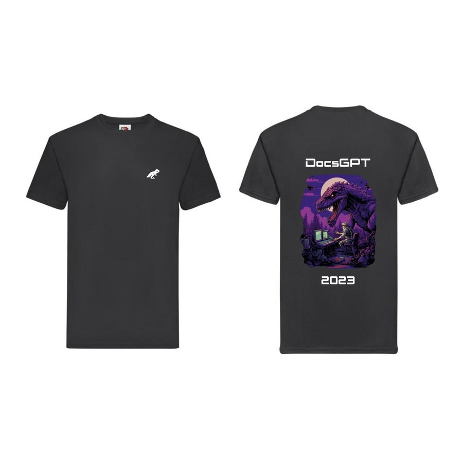
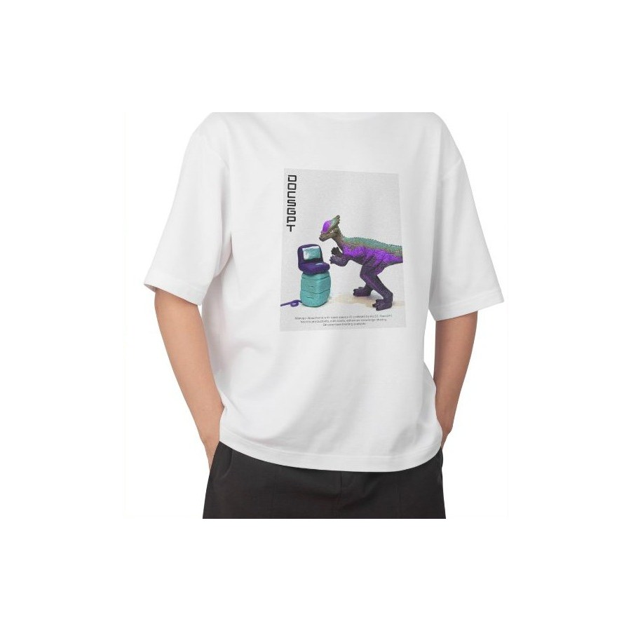
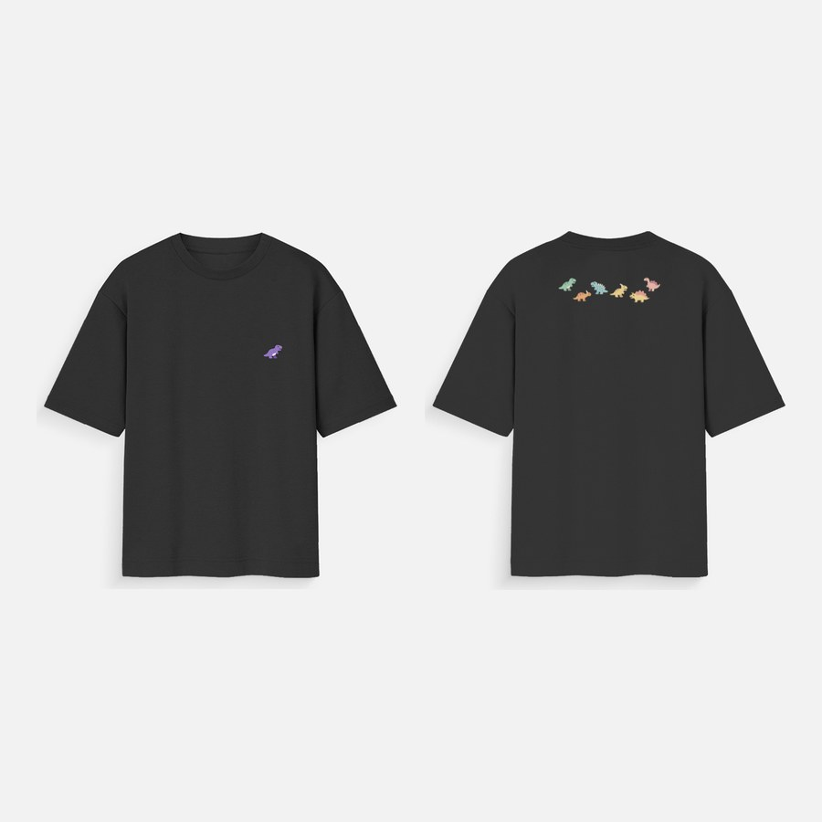

# 🎃 Hacktoberfest 2026 with DocsGPT

Welcome, contributors! DocsGPT is taking part in [Hacktoberfest](https://hacktoberfest.com/) 2026, from **October 1
to October 31, 2026**.

We're giving away **T-shirts for meaningful contributions** 👕: merged pull requests that fix a real bug, add a
feature or noticeably improve the docs. Typo fixes and other trivial changes don't qualify.

Any meaningful pull request merged during Hacktoberfest qualifies, whether or not it closes a labelled issue. Our
maintainer team (dartpain, siiddhantt, pabik, ManishMadan2882) sets the `hacktoberfest` label on issues that are good to
pick up; those are suggestions, not a requirement. The team also reviews the pull requests.

**The T-shirt design and the claim form will be announced later**, on our [Discord](https://discord.gg/vN7YFfdMpj)
and in the [README](README.md). Keep a link to your merged PR so you can claim once the form is out.

Here are the T-shirts from previous years:

<table>
  <tr>
    <td width="33%" valign="top">
      
      
<b>2023</b>

    </td>
    <td width="33%" valign="top">
      
      
<b>2024</b>: designed by Cardboard, winner of #DocsGPTDesignQuest

    </td>
    <td width="33%" valign="top">
      
      
<b>2025</b>

    </td>
  </tr>
</table>

If you're in doubt, don't hesitate to ask on Discord or ping me, Alex (dartpain).

## 📜 How to contribute

- 🛠️ **Code**: the golden ticket. Fix a bug or build a feature through a pull request. The
  [`hacktoberfest` issues](https://github.com/arc53/DocsGPT/issues?q=is%3Aissue+is%3Aopen+label%3Ahacktoberfest) are a
  good place to start, but any other issue counts too.
- 🧩 **API extension**: build an app on top of the DocsGPT API. We prefer submissions that show an original idea and
  turn the API into an AI agent. It can live in its own repository, like the
  [Telegram bot](https://github.com/arc53/tg-bot-docsgpt-extenstion) or the
  [DocsGPT CLI](https://github.com/arc53/DocsGPT-cli).
- 📚 **Docs**: improve the [documentation](https://docs.docsgpt.cloud/) or write a guide. The site's source is in the
  [`docs/`](docs/) folder.
- 🖥️ **Design**: improve the UI/UX or design a new feature.

## 📝 Guidelines for pull requests

- Look at the current contributions and our [roadmap](https://github.com/orgs/arc53/projects/2).
- Before you start, check the existing [issues](https://github.com/arc53/DocsGPT/issues) or
  [create one](https://github.com/arc53/DocsGPT/issues/new/choose), and wait to be assigned.
- Read [CONTRIBUTING.md](CONTRIBUTING.md) and the [documentation](https://docs.docsgpt.cloud/).
- Join our [Discord](https://discord.gg/vN7YFfdMpj) server. We're here to help newcomers, so jump in!

Thank you very much for considering contributing to DocsGPT during Hacktoberfest! 🙏
