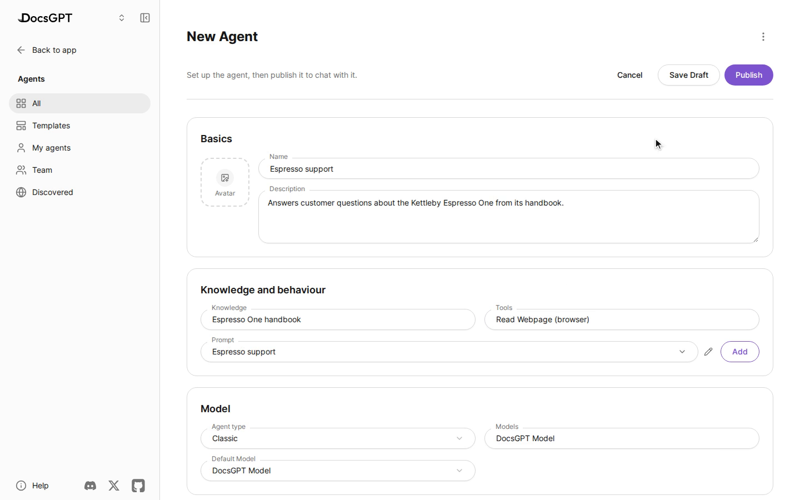
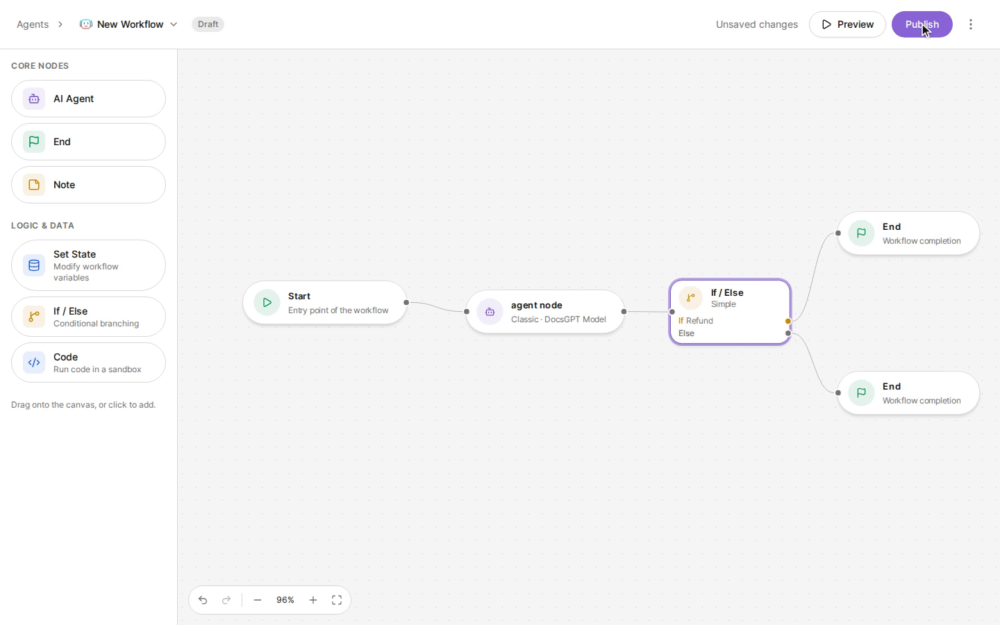
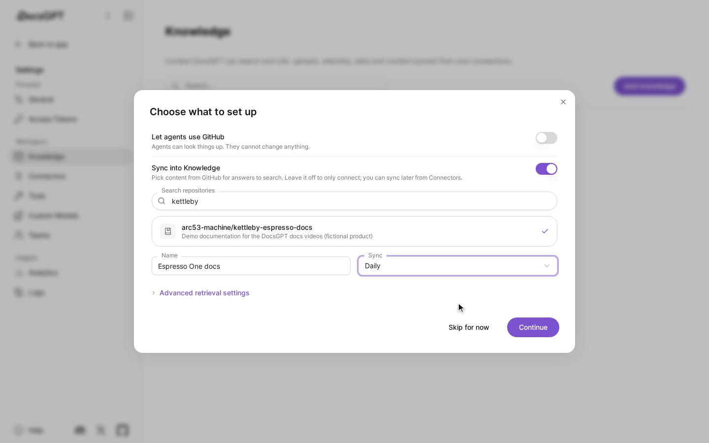
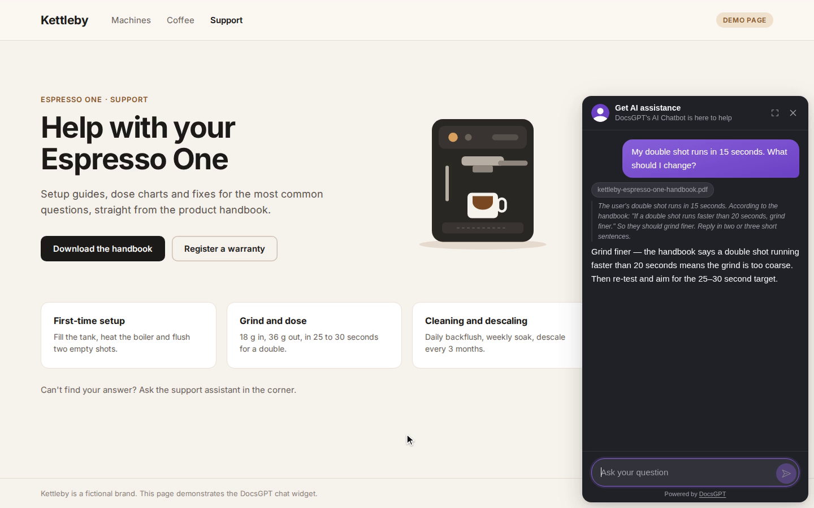
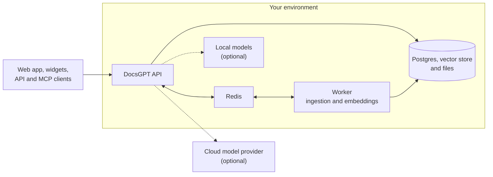

<h1 align="center">
  DocsGPT 🦖
</h1>

<p align="center">
  <strong>Open-source AI agents grounded in your docs. Private, self-hosted, any model.</strong>
</p>

<p align="center">
  <a href="https://github.com/arc53/DocsGPT"></a>
  <a href="https://github.com/arc53/DocsGPT/blob/main/LICENSE"></a>
  <a href="https://www.bestpractices.dev/projects/9907"></a>
  <a href="https://discord.gg/vN7YFfdMpj"></a>
  <a href="https://x.com/docsgptai"></a>
</p>

<p align="center">
  <a href="https://docs.docsgpt.cloud/quickstart">⚡️ Quickstart</a> •
  <a href="https://app.docsgpt.cloud/">☁️ Cloud</a> •
  <a href="https://docs.docsgpt.cloud/">📖 Docs</a> •
  <a href="https://discord.gg/vN7YFfdMpj">💬 Discord</a> •
  <a href="https://blog.docsgpt.cloud/">🗞 Blog</a>
</p>

<!-- languages:start -->
<p align="center">
  <strong>English</strong> |
  <a href=".github/readme/README.de.md">Deutsch</a> |
  <a href=".github/readme/README.es.md">Español</a> |
  <a href=".github/readme/README.ja.md">日本語</a> |
  <a href=".github/readme/README.ru.md">Русский</a> |
  <a href=".github/readme/README.zh-CN.md">简体中文</a> |
  <a href=".github/readme/README.zh-TW.md">繁體中文</a>
</p>
<!-- languages:end -->

> [!TIP]
> Self-host in one command. On macOS and Linux:
> ```bash
> curl -fsSL https://docs.ac/install | bash
> ```
> On Windows (PowerShell): `irm https://docs.ac/install.ps1 | iex`

<p align="center">
  <a href="https://docs.docsgpt.cloud/">
    
  </a>
</p>

> 🎃 **Hacktoberfest 2026:** T-shirts for meaningful contributions, all October. See [HACKTOBERFEST.md](HACKTOBERFEST.md).

## Why DocsGPT

DocsGPT turns your documents, sites and connected apps into AI agents that answer with sources. Build agents and
visual workflows, give them tools, and put them in your product through a widget, an OpenAI-compatible API or an
MCP server. It runs entirely in your environment with the model of your choice, cloud or local, and everything,
including SSO, teams and quotas, is MIT licensed.

## Quickstart

The installer above checks for [Docker](https://docs.docker.com/engine/install/), installs the `docsgpt` command and
runs `docsgpt up`, which asks who should reach DocsGPT and which model to use. A local install opens at
[http://localhost:7091](http://localhost:7091).

Prefer Docker Compose, pip, Kubernetes or an air-gapped install? See [Choose a deployment](https://docs.docsgpt.cloud/Deploying).
Just want to try it? Use [DocsGPT Cloud](https://app.docsgpt.cloud/).

## Features

- 🤖 **Agents and deep research:** agents with their own prompt, knowledge, tools and model, plus a research mode for multi-step answers.
- 🔀 **Visual workflows:** chain agents, conditions, state and sandboxed code in a drag-and-drop builder.
- 📚 **Knowledge from anywhere:** PDFs, Office files, web pages, audio and more, kept in sync from Google Drive, SharePoint, Confluence, GitHub, S3 and others, with GraphRAG.
- 🔎 **Answers with sources:** every answer cites the documents it came from.
- 🛠️ **Tools and actions:** web search, any REST API, MCP servers, artifacts and code in a sandbox, and shell on paired devices.
- 🧠 **Any model:** OpenAI, Anthropic, Google, Groq, OpenRouter, or local models through Ollama, vLLM and other OpenAI-compatible servers.
- 🛡️ **Guardrails:** flag, redact or block PII, secrets, prompt injection and ungrounded answers.
- ⏰ **Schedules and webhooks:** run agents on a timer or from any system that can send an HTTP request.

https://github.com/user-attachments/assets/d36bbd7d-c23c-4ab8-8777-b432632d6882

<table>
  <tr>
    <td width="50%" valign="top">
      <a href="https://docs.docsgpt.cloud/Agents/basics"></a>
      <p align="center"><b>Agents</b>: knowledge, tools and a prompt, published in a click</p>
    </td>
    <td width="50%" valign="top">
      <a href="https://docs.docsgpt.cloud/Agents/nodes"></a>
      <p align="center"><b>Workflows</b>: agents and logic on one canvas</p>
    </td>
  </tr>
  <tr>
    <td width="50%" valign="top">
      <a href="https://docs.docsgpt.cloud/Sources/Connectors"></a>
      <p align="center"><b>Knowledge</b>: connect a service and keep it in sync</p>
    </td>
    <td width="50%" valign="top">
      <a href="https://docs.docsgpt.cloud/Extensions/chat-widget"></a>
      <p align="center"><b>Widget</b>: your agent on any website</p>
    </td>
  </tr>
</table>

See the [documentation](https://docs.docsgpt.cloud/) for everything else.

## Use it anywhere

- **Web app:** chat, agents, knowledge and settings in the browser.
- **Chat and search widgets:** drop an agent into any site with a script tag or the [React package](https://docs.docsgpt.cloud/Extensions/chat-widget).
- **OpenAI-compatible API:** point any OpenAI SDK at [`/v1`](https://docs.docsgpt.cloud/API/openai-compatible), or use the [Agent API](https://docs.docsgpt.cloud/API/agent-api) and [webhooks](https://docs.docsgpt.cloud/API/webhooks).
- **MCP server:** let Claude, Cursor or any [MCP client](https://docs.docsgpt.cloud/API/mcp-server) search your agent's knowledge.
- **Chat apps and the terminal:** bots for [Discord](https://github.com/arc53/discord-docsgpt-extension), [Slack](https://github.com/arc53/slack-bot-docsgpt-extenstion) and [Telegram](https://github.com/arc53/tg-bot-docsgpt-extenstion), and the [DocsGPT CLI](https://github.com/arc53/DocsGPT-cli). More in [community integrations](https://docs.docsgpt.cloud/Extensions/community).

## Private by design

Everything runs inside your environment: the API, the worker, Postgres, Redis, your vector store and your files.
Pick a cloud model provider or run models and embeddings locally, even [air-gapped](https://docs.docsgpt.cloud/Deploying/Air-Gapped).



Read the [architecture guide](https://docs.docsgpt.cloud/Concepts/Architecture) and the
[security checklist](https://docs.docsgpt.cloud/Deploying/Security) before exposing DocsGPT beyond your machine.

## Self-host

After the one-command install, the `docsgpt` command manages the stack:

```bash
docsgpt status     # version, address and health
docsgpt logs       # follow the logs
docsgpt upgrade    # upgrade and restart on the new version
docsgpt backup     # back up the database and uploaded data
docsgpt down       # stop (data and settings stay)
```

See the [CLI reference](https://docs.docsgpt.cloud/Deploying/cli) for every command. Other ways to run it:
[Docker Compose](https://docs.docsgpt.cloud/Deploying/Docker-Deploying),
[pip](https://docs.docsgpt.cloud/Deploying/Pip-Install),
[Kubernetes](https://docs.docsgpt.cloud/Deploying/Kubernetes-Deploying),
[air-gapped](https://docs.docsgpt.cloud/Deploying/Air-Gapped), or
[from a clone with the setup script](https://docs.docsgpt.cloud/Deploying/Docker-Deploying#using-the-source-checkout).
To work on DocsGPT itself, see the [development environment guide](https://docs.docsgpt.cloud/Deploying/Development-Environment).

## For teams

- **Single sign-on:** [OIDC and SCIM](https://docs.docsgpt.cloud/Deploying/OIDC-SSO) provisioning.
- **Access control:** [roles, teams and sharing](https://docs.docsgpt.cloud/Deploying/Access-Control) for agents, knowledge and tools, with an audit log.
- **Usage quotas:** [token and spend limits](https://docs.docsgpt.cloud/Deploying/Usage-Quotas) per user and team.
- **Insight:** analytics, logs and traces, plus [OpenTelemetry](https://docs.docsgpt.cloud/Deploying/Observability).

Deploying DocsGPT for your company? [Get a demo](https://www.docsgpt.cloud/contact) or
[email us](mailto:support@docsgpt.cloud?subject=DocsGPT%20support%2Fsolutions).

## Contributing

We welcome issues, questions and pull requests. Start with [CONTRIBUTING.md](CONTRIBUTING.md), browse the
[roadmap](https://github.com/orgs/arc53/projects/2) and the [changelog](https://docs.docsgpt.cloud/changelog), and say hi on
[Discord](https://discord.gg/vN7YFfdMpj). Please follow our [Code of Conduct](CODE_OF_CONDUCT.md).

<details>
<summary>Tech stack and project structure</summary>

- **Backend:** Python, Flask and flask-restx behind a Starlette ASGI app (uvicorn/gunicorn), Celery with RedBeat, Pydantic settings.
- **Data:** PostgreSQL (SQLAlchemy, Alembic), Redis, and FAISS, pgvector, Elasticsearch, Qdrant, Milvus or MongoDB for vectors.
- **Frontend:** React, Vite, Redux Toolkit, Tailwind CSS and React Flow.
- **Docs:** Next.js with Nextra.

Project structure:

- `docsgpt/`: the backend and the `docsgpt` command (API, agents, tools, retrieval, parsers, worker).
- `frontend/`: the web UI.
- `extensions/`: the Chatwoot bridge and the React widget (published to npm as `docsgpt`).
- `deployment/`: Docker Compose files, Kubernetes manifests, the installer scripts and the sandbox image.
- `docs/`: the documentation site at [docs.docsgpt.cloud](https://docs.docsgpt.cloud).
- `tests/` and `scripts/`: tests, and maintenance and migration scripts.

</details>

## License

DocsGPT is [MIT licensed](LICENSE).

## Supported by

<p>
  <a href="https://www.digitalocean.com/?utm_medium=opensource&utm_source=DocsGPT">
    
  </a>
</p>
<p>
  <a href="https://get.neon.com/docsgpt">
    
  </a>
</p>
