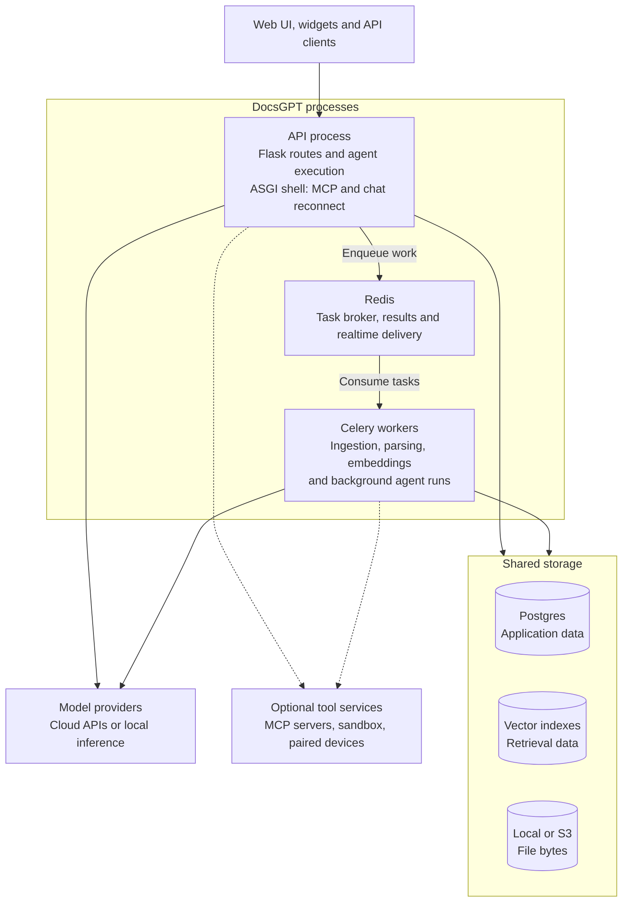
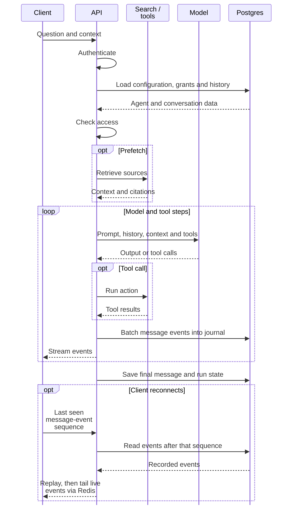
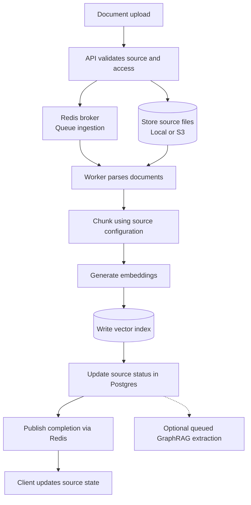

import { Callout } from 'nextra/components'

## Introduction

DocsGPT combines a web application, an agent runtime, and a document retrieval pipeline. An agent can answer from indexed sources, decide when to search, call tools, or execute a workflow. The same backend serves the web UI, embedded widgets, and API clients.

This page describes the components and their execution boundaries. For installation commands, use the [development](/Deploying/Development-Environment), [package](/Deploying/Pip-Install), [Docker](/Deploying/Docker-Deploying), or [Kubernetes](/Deploying/Kubernetes-Deploying) guide.

## High-level architecture

The API and Celery workers are separate processes that reuse the same agent, model, parser, retrieval, and storage modules. Redis carries queued work between them; both processes need access to the configured storage and model services.

The storage boxes describe responsibilities, not a required number of servers. FAISS runs in-process and persists index files through local or S3 storage; pgvector can share a PostgreSQL server with application data. Dashed connections represent optional tool integrations. Redis also handles caching and live event delivery, which the task arrows omit.

## Component responsibilities

| Component | Where it runs | Responsibility |
| --- | --- | --- |
| **Web UI** | Browser; static assets served separately or by the packaged API | React/Vite application for conversations, sources, agents, workflows, tools, and settings. |
| **API** | Python API process | Authentication, resource access, chat/search endpoints, uploads, agent execution, and streaming responses. |
| **Agent runtime** | API for interactive requests; worker for background runs | Builds prompts and context, invokes models and tools, tracks runs, and executes workflows. |
| **Retrieval** | In the process running the search or agent | Dispatches per-source retrieval, combines results under a token budget, and applies configured post-retrieval stages. |
| **Model adapters** | Shared Python modules | Translate generation, streaming, tool calls, and usage for cloud or local providers. Embedding configuration is separate from the chat model. |
| **Celery workers** | One or more worker processes | Ingestion, attachment processing, document parsing, query embedding, webhooks, and scheduled agent execution. |
| **Scheduler** | Celery beat, embedded or separate | Triggers maintenance, source syncs, and dispatch of scheduled runs. |

### API entry points

[The ASGI application](https://github.com/arc53/DocsGPT/blob/main/docsgpt/asgi.py) mounts Flask through a WSGI adapter, the FastMCP server, and native asynchronous chat-reconnect readers in one process.

| Interface | Purpose |
| --- | --- |
| [Native agent API](/Agents/api) | Answer, streaming, and search endpoints used by the UI and integrations. |
| [OpenAI-compatible API](/Agents/openai-compatible) | `/v1/chat/completions` and `/v1/models` for compatible clients, authenticated with an agent API key. |
| [MCP server](https://github.com/arc53/DocsGPT/blob/main/docsgpt/mcp_server.py) | `/mcp` exposes the `search_docs` retrieval tool to MCP clients using an agent API key. |
| [Agent webhooks](/Agents/webhooks) | Trigger background agent runs from external applications. |
| [Real-time events](/Agents/notifications) | User notifications at `/api/events` and chat replay/live tail at `/api/messages/<message_id>/events`. |

DocsGPT also acts as an **MCP client**: agents can call external MCP servers through the [MCP tool integration](/Guides/Integrations/mcp-tool-integration). This is a separate direction from exposing DocsGPT search at `/mcp`.

<Callout type="info">
Use the ASGI entry point for the complete application. A plain `flask run` server omits `/mcp` and the native async chat-reconnect routes. See [Development Environment](/Deploying/Development-Environment).
</Callout>

### Agents and retrieval

The [agent types](/Agents/basics#understanding-agent-types) control how a request gathers information and performs work:

- **Classic** retrieves configured source context before answering and can use configured tools.
- **Agentic** gives the model an `internal_search` tool so it can search as needed, refine a query, or answer without retrieval.
- **Research** coordinates clarification, planning, research, and synthesis with execution budgets.
- **Workflow** executes a graph of nodes with shared state and branching. See [Workflow Nodes](/Agents/nodes).

[Per-source configuration](/Sources/Per-source-configuration) can mix context retrieved before generation and sources exposed through the search tool. The retrieval dispatcher groups sources by retriever and merges results under a shared token budget. Optional query rephrasing happens before retrieval; relevance pre-screening happens afterward.

The retrieval paths are classic vector similarity, hybrid vector/keyword search, and [GraphRAG](/Sources/GraphRAG). GraphRAG requires `GRAPHRAG_ENABLED=true` and `VECTOR_STORE=pgvector`; its graph tables live alongside the vectors. Sources without a ready graph can fall back to classic retrieval.

Model adapters keep agent logic independent of the provider. See [Cloud Providers](/Models/cloud-providers), [Local Inference](/Models/local-inference), and [Embeddings](/Models/embeddings) for supported options. [Prompt assembly](/Guides/Customising-prompts) and [context compression](/Guides/compression) determine what context reaches the model.

## Answer lifecycle

This sequence shows an interactive streaming request. Retrieval and tool calls are optional and can repeat; a workflow can compose several such steps.

Interactive generation runs in the API process. A client disconnect can be followed by replay and a live tail while generation continues; this does not restart generation after an API process crash. Reconnect can happen during generation, not only after the final message shown above.

For persisted chat, Postgres holds the `message_events` journal and Redis pub/sub carries live events. User notifications use a separate Redis Stream backlog. See [Real-time Events](/Agents/notifications) for replay cursors, retention, and connection limits.

When a tool requires approval, interactive execution pauses and stores continuation state; the client can submit the decision to resume. Background [webhook](/Agents/webhooks) and scheduled runs execute through Celery using the shared agent runtime. Their tool policies differ where no interactive approval is available.

## Document lifecycle

Source ingestion builds reusable retrieval indexes. This diagram follows an uploaded source. Chat attachments and files read by tools follow related parsing paths but do not automatically become indexed knowledge sources.

Connectors enqueue source identifiers and configuration; workers fetch the remote content before parsing. Progress events are also emitted during parsing and indexing, before the completion event shown above.

The default parser engine is `anydoc`. Docling is an optional parser engine, and OCR is configured separately. Parsing, chunking, and retrieval settings belong to the source; see [Per-Source Configuration](/Sources/Per-source-configuration) and [OCR](/Guides/ocr). Ingestion tracks chunk progress so retries can resume interrupted embedding/indexing work.

For GraphRAG sources, graph extraction is a separate queued step after indexing. Retrieval can use the vector index while the graph is being built.

### Worker queues and embeddings

[Celery routing](https://github.com/arc53/DocsGPT/blob/main/docsgpt/celeryconfig.py) separates three queues by default:

| Queue | Work |
| --- | --- |
| `docsgpt` | Ingestion, attachment processing, graph extraction, background agents, and maintenance. Source ingestion parses documents inside this task. |
| `parsing` | Explicit `parse_document` requests from tools and workflow file handling. A `read_document` call already running inside a worker parses directly in that process. |
| `embeddings` | Delegated embedding requests, including query embeddings needed for retrieval. |

A worker started without `-Q` consumes all configured queues. Separate workers can isolate expensive parsing and ingestion from query embedding; three queues do not require three worker processes.

<Callout type="info">
Query embedding is delegated to Celery by default (`EMBEDDINGS_DELEGATE_TO_WORKER=true`). A worker must consume the embedding queue for that retrieval path to work. Set `EMBEDDINGS_BASE_URL` to use an embedding service, or disable delegation to load the model in the API process. Other background features still need a worker.
</Callout>

Inside a worker task, the embedding adapter runs directly instead of submitting another embedding task to itself. Indexing and querying must use consistent embedding configuration. Changing the embedding model requires rebuilding the affected embeddings; see [Embeddings](/Models/embeddings).

## Storage and access boundaries

| Storage | Data and role |
| --- | --- |
| **PostgreSQL application database** | Canonical user data: conversations, message events, agents, workflows, sources, schedules, permissions, tool state, and usage. Accessed through database repositories; schema changes use Alembic. |
| **Redis** | Celery broker/results, caching, live pub/sub, user notification backlogs, and scheduler coordination. |
| **Vector store** | Document chunks and embeddings for retrieval. The default is file-backed FAISS; external stores and pgvector are configurable. GraphRAG uses the pgvector database, which may be separate from application Postgres. |
| **File storage** | Uploaded documents, attachments, artifact bytes, and FAISS index files through the local or S3-compatible adapter. Application metadata and permissions remain in Postgres. |

MongoDB is optional for Mongo Atlas Vector Search or a [legacy user-data migration](/Deploying/Postgres-Migration); it is not required for the default installation.

Authentication and resource authorization happen at API boundaries. [OIDC SSO](/Deploying/OIDC-SSO), [roles and team grants](/Deploying/Access-Control), and agent API keys serve different access paths. Authentication defaults to local no-auth mode; SSO and persisted roles require configuration. Tool approvals and configured guardrails provide additional checks during agent execution.

Tool execution can cross another process or machine boundary. [Artifacts and code execution](/Tools/artifacts-and-code-execution) use an optional sandbox runner. [Remote Device](/Tools/remote-device) executes on a paired machine running `docsgpt-cli host`, which connects outward to DocsGPT. External MCP servers provide their own tool execution environment.

## Deployment architecture

A typical installation needs an API process, a Celery worker, Postgres, Redis, persistent file/index storage, and access to its configured models. Add a scheduler for scheduled runs and periodic jobs. A GPU, external vector database, separate frontend server, and sandbox are configuration choices.

| Deployment | Shape |
| --- | --- |
| [Python package](/Deploying/Pip-Install) | `docsgpt api` serves the API and bundled web UI. A separate `docsgpt worker` process handles background work; Postgres and Redis remain services. |
| [Local development](/Deploying/Development-Environment) | Vite frontend, ASGI API, and Celery worker run separately against existing Postgres and Redis services. |
| [Docker](/Deploying/Docker-Deploying) | Compose defines processes, data services, and volumes; exact services depend on the chosen Compose file. |
| [Kubernetes](/Deploying/Kubernetes-Deploying) | API, frontend, and worker deployments connect to configured data services. Database migrations are handled separately during deployment. |

When splitting services across machines, plan access to file storage and indexes as well as databases. With local storage, the API and workers need consistent shared paths. S3 can hold source and FAISS index files, but FAISS still executes inside the calling process. Models and enabled tool services must be reachable from the process using them.

Ingestion workers also call back to the API to register sources and indexes. Configure a reachable `API_URL` and a matching `INTERNAL_KEY` on the API and workers.

Serve the ASGI application behind a proxy configured for SSE. Keep the scheduler topology deliberate when scaling workers, and run schema migrations as part of deployment. See [App Configuration](/Deploying/DocsGPT-Settings) and [Observability](/Deploying/Observability).

## Related Arc53 projects

These open-source projects connect through the API, provide optional tool execution, or supply libraries used inside the backend. They do not all need to be deployed together.

| Project | Relationship to the architecture |
| --- | --- |
| [React/HTML widgets](https://github.com/arc53/DocsGPT/tree/main/extensions/react-widget) | Browser clients in this repository: [chat](/Extensions/chat-widget) uses streaming, while [search](/Extensions/search-widget) calls the search API. |
| [DocsGPT-cli](https://github.com/arc53/DocsGPT-cli) | Separate Go client for terminal chat and [agent benchmarking](/Guides/Benchmarking-Agents). Chat uses the OpenAI-compatible API. Its `host` mode supplies the paired execution target for [Remote Device](/Tools/remote-device). |
| [Telegram extension](https://github.com/arc53/tg-bot-docsgpt-extenstion) | Separate bot service calling the native answer/streaming API, with attachment, speech, and artifact support. |
| [Slack extension](https://github.com/arc53/slack-bot-docsgpt-extenstion) and [Chatwoot bridge](https://github.com/arc53/DocsGPT/tree/main/extensions/chatwoot) | Optional messaging integrations calling the answer API. Chatwoot's bridge lives in this repository; see [Chatwoot Extension](/Extensions/Chatwoot-extension). |
| [fast-ebook](https://github.com/arc53/fast-ebook) | EPUB parsing library used by the backend EPUB parser. It runs inside the parsing process, not as another service. |

The Python package's `docsgpt api` and `docsgpt worker` commands operate the server. The separate `docsgpt-cli` project is a client and optional device host. Any bot-specific conversation mapping or database belongs to that integration, not to DocsGPT's default server requirements.

## Code map

The main extension points in [arc53/DocsGPT](https://github.com/arc53/DocsGPT) are:

| Area | Source |
| --- | --- |
| API and serving | [`docsgpt/asgi.py`](https://github.com/arc53/DocsGPT/blob/main/docsgpt/asgi.py), [`docsgpt/api/`](https://github.com/arc53/DocsGPT/tree/main/docsgpt/api), [`docsgpt/ui.py`](https://github.com/arc53/DocsGPT/blob/main/docsgpt/ui.py) |
| Agents, tools, and workflows | [`docsgpt/agents/`](https://github.com/arc53/DocsGPT/tree/main/docsgpt/agents) |
| Retrieval and graph search | [`docsgpt/retriever/`](https://github.com/arc53/DocsGPT/tree/main/docsgpt/retriever), [`docsgpt/graphrag/`](https://github.com/arc53/DocsGPT/tree/main/docsgpt/graphrag) |
| Parsing and workers | [`docsgpt/parser/`](https://github.com/arc53/DocsGPT/tree/main/docsgpt/parser), [`docsgpt/worker.py`](https://github.com/arc53/DocsGPT/blob/main/docsgpt/worker.py), [`docsgpt/api/user/tasks.py`](https://github.com/arc53/DocsGPT/blob/main/docsgpt/api/user/tasks.py) |
| Models and vector stores | [`docsgpt/llm/`](https://github.com/arc53/DocsGPT/tree/main/docsgpt/llm), [`docsgpt/vectorstore/`](https://github.com/arc53/DocsGPT/tree/main/docsgpt/vectorstore) |
| Storage and events | [`docsgpt/storage/`](https://github.com/arc53/DocsGPT/tree/main/docsgpt/storage), [`docsgpt/streaming/`](https://github.com/arc53/DocsGPT/tree/main/docsgpt/streaming), [`docsgpt/events/`](https://github.com/arc53/DocsGPT/tree/main/docsgpt/events) |
| Configuration, UI, and deployment | [`docsgpt/core/settings.py`](https://github.com/arc53/DocsGPT/blob/main/docsgpt/core/settings.py), [`frontend/`](https://github.com/arc53/DocsGPT/tree/main/frontend), [`deployment/`](https://github.com/arc53/DocsGPT/tree/main/deployment) |
