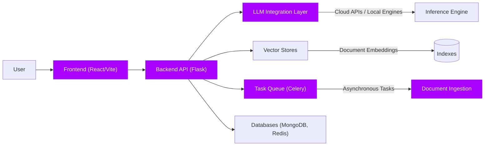
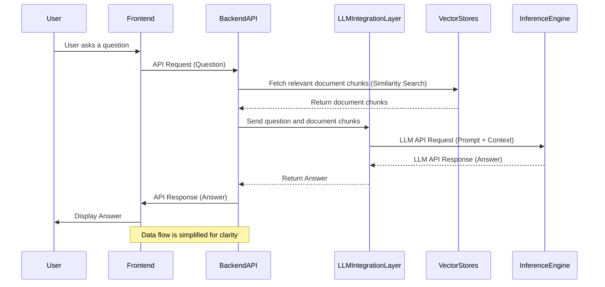
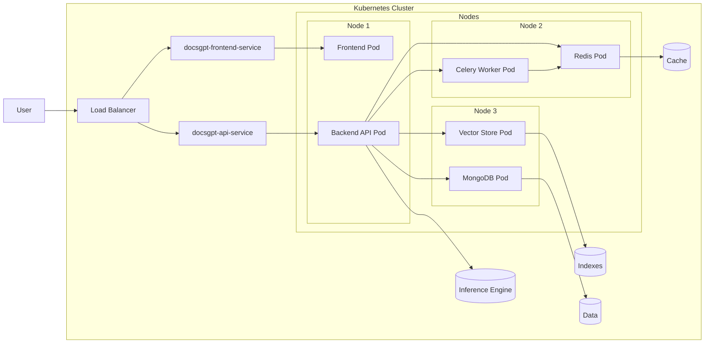

## Introduction

DocsGPT is designed as a modular and scalable application for knowledge based GenAI system. This document outlines the high-level architecture of DocsGPT, highlighting its key components.

## High-Level Architecture

This diagram provides a bird's-eye view of the DocsGPT architecture, illustrating the main components and their interactions.

## Component Descriptions

### 1. Frontend (React/Vite)

*   **Technology:** Built using React and Vite.
*   **Responsibility:** This is the user interface of DocsGPT, providing users with an UI to ask questions and receive answers, configure prompts, tools and other settings. It handles user input, displays conversation history, shows sources, and manages settings.
*   **Key Features:**
    *   Clean and responsive UI.
    *   Simple static client-side rendering.
    *   Manages conversation state and settings.
    *   Communicates with the Backend API for data retrieval and processing.

### 2. Backend API (Flask)

*   **Technology:** Implemented using Flask (Python).
*   **Responsibility:** The Backend API serves as the core logic and orchestration layer of DocsGPT. It receives requests from the Frontend, Extensions or API clients, processes them, and coordinates interactions between different components.
*   **Key Features:**
    *   API endpoints for handling user queries, document uploads, and settings configurations.
    *   Manages the overall application flow and logic.
    *   Integrates with the LLM Integration Layer, Vector Stores, Task Queue, Tools, Agents and Databases.
    *   Provides Swagger documentation for API endpoints.

### 3. LLM Integration Layer (Part of backend)

*   **Technology:** Supports multiple LLM APIs and local engines.
*   **Responsibility:** This layer provides an abstraction for interacting with Large Language Models (LLMs).
*   **Key Features:**
    *   Supports LLMs from OpenAI, Google, Anthropic, Groq, HuggingFace Inference API, Azure OpenAI, also compatable with local models like Ollama, LLaMa.cpp, Text Generation Inference (TGI), SGLang, vLLM, Aphrodite, FriendliAI, and LMDeploy.
    *   Manages API key handling and request formatting and Tool fromatting.
    *   Offers caching mechanisms to improve response times and reduce API usage.
    *   Handles streaming responses for a more interactive user experience.

### 4. Vector Stores (Part of backend)

*   **Technology:** Supports multiple vector databases.
*   **Responsibility:** Vector Stores are used to store and retrieve vector embeddings of document chunks. This enables semantic search and retrieval of relevant document snippets in response to user queries.
*   **Key Features:**
    *   Supports vector databases including FAISS, Elasticsearch, Qdrant, Milvus, and LanceDB.
    *   Provides storage and indexing of high-dimensional vector embeddings.
    *   Enables editing and updating of vector indexes including specific chunks.

### 5. Parser Integration Layer (Part of backend)

*   **Technology:** Supports multiple formats for file processing and remote source uploading.
*   **Responsibility:** Parser Integration Layer handles uploading, parsing, chunking, embedding, and indexing documents.
*   **Key Features:**
    *   Supports various document formats (PDF, DOCX, TXT, etc.) and remote sources (web URLs, sitemaps).
    *   Handles document parsing, text chunking, and embedding generation.
    *   Utilizes Celery for asynchronous processing, ensuring efficient handling of large documents.

### 6. Task Queue (Celery)

*   **Technology:** Celery with Redis as broker and backend.
*   **Responsibility:** Celery handles asynchronous task processing, for long-running operations such as document ingestion and indexing. This ensures that the main application remains responsive and efficient.
*   **Key Features:**
    *   Manages background tasks for document processing and indexing.
    *   Improves application responsiveness by offloading heavy tasks.
    *   Enhances scalability and reliability through distributed task processing.

### 7. Databases (MongoDB, Redis)

*   **Technology:** MongoDB and Redis.
*   **Responsibility:** Databases are used for persistent data storage and caching. MongoDB stores structured data such as conversations, documents, user settings, and API keys. Redis is used as a cache, as well as a message broker for Celery.

## Request Flow Diagram

This diagram illustrates the sequence of steps involved when a user submits a question to DocsGPT.

## Deployment Architecture

DocsGPT is designed to be deployed using Docker and Kubernetes, here is a qucik overview of a simple k8s deployment.

